# 技术设计

## 总体架构

```text
浏览器
  Vite + React 题库后台
  基于已迁移的 local-platform 演示前端
  左侧导航：题目导入 / 题库中心 / 组卷中心 / 知识点库
  当前作为本地小平台，调用 Java 业务 API 和题目加工能力 API
    |
Java 主后端（第一阶段并行骨架）
  Spring Boot 3.3.5 / Java 17
  健康检查 / TraceId / CORS
  Python worker 连通性探测
  OCR-Flow 能力 API：/api/capabilities/ocr-flow
  题目加工能力 API：/api/capabilities/question-processing
  能力总目录：/api/capabilities
  补充能力：review-workbench / ai-flow / export-flow / file-flow / callback-flow / sdk-openapi
  Engine 能力目录：/api/engine
  标准题目包：question-package.v1
  题图归属 JSON 持久化：images 资产池 + imagePlacements owner/evidence/inference
  题图结构守卫：imagePlacementValidation 进入统一单题/全局标准化 structuredHints
  知识点 / 题库题目 / 试卷基础 CRUD
  导入任务元数据、状态机与题目/题图同步
  导入原文件 Java 存储与预览
  导入题入库 bridge 与 Java 题库表同步
  题图上传/访问/image-library Java file-flow
  AI 标准化候选与 AI 解析写回 Java job 编排
  试卷导出 Java job 元数据与导出文件存储
  callback-flow HTTP 回调签名、事件记录和重试入口
  MyBatis Plus / H2 本地库 / MySQL profile
  /api/* 反向代理兜底
  后续承载完整导入编排、认证、权限和企业化依赖
    |
FastAPI / Python worker
  文件上传
  OCR-Flow 编排
  默认 MinerU provider 子进程调用
  provider adapter -> CanonicalOcrBundle v1
  OcrPostProcessingPipeline 统一后处理入口
  大模型拆题
  AI 题目元数据补全
  选择题选项链恢复 + 跨页二维单元格 + 全局一对一题图分配
  canonicalization 复用已保存 OCR 布局，输出旧/新归属差异与阻断机器码
  公式标准化与校验
  图片归属协调：Markdown offset 优先，page/bbox 几何只读补充，冲突进入人工复核
  导出运行时探针：/api/system/export-flow、/worker/export-flow
  Java 调用的导出渲染 worker：/worker/export/render
  导入任务
  题库 AI 标准化候选 / AI 解析 / 题图
  试卷导出
  OCR 产物文件服务
    |
OCR provider（默认 MinerU 命令行，可替换）
DeepSeek / OpenAI 兼容 LLM 接口
    |
backend/storage
  uploads/
  import_uploads/
  jobs/
  outputs/
  exports/
  library_store.json
  java_library.mv.db
```

OCR 与题库后处理之间不再以 MinerU 目录为公共契约。Provider 私有结果只由对应 adapter 解释，Post Process 只接收 `canonical-ocr-bundle.v1`。当前 `run_bundle()` 继续委托既有算法实现，保证拆题、题图、公式、LLM 调用顺序和 outputs 不变。远程平台使用 Question Engine SDK；Python worker 内的新 provider 使用 `app.ocr` 嵌入式入口。完整契约见 [OCR Post Process 使用说明书](../delivery/POST_PROCESS_USAGE_GUIDE.md)。

## 导入 OCR 工作台业务与技术流程

颜色约定：

- 绿色：本地算力或本地存储处理，包括浏览器渲染、FastAPI 编排、本地文件写入、MinerU 命令行、本地规则拆题、公式校验和题库入库。
- 黄色：外部 API 算力，当前主要是 DeepSeek / OpenAI 兼容 LLM 接口，也兼容百炼或平台模型网关。
- 蓝色：混合链路，包含本地预处理、外部模型调用和本地兜底/归一化的组合能力。

```mermaid
flowchart TD
  LegendLocal["绿色：本地算力 / 本地存储"]:::local
  LegendExternal["黄色：外部 API 算力"]:::external
  LegendMixed["蓝色：混合编排 / 本地兜底"]:::mixed

  Start(["用户进入题库中心<br/>导入 OCR 工作台"]):::local
  Create["填写导入标题、学段、学科、年级、年份<br/>上传试卷文件，可选上传答案文件"]:::local
  Required["必填项校验与缺失项提示<br/>标题、学科、年级、年份、试卷文件等"]:::local
  NameDedup["导入任务标题查重<br/>不允许创建同名任务"]:::local
  Post["POST /api/import-tasks<br/>Java bridge 接收表单与文件"]:::local
  Persist["写入 Java 文件存储和 Python OCR 存储<br/>java_storage_files、import_uploads/、jobs/、library_store.json"]:::local
  ReturnTask["返回处理中导入任务<br/>前端选中任务并进入工作台"]:::local
  TaskManage["历史任务列表<br/>支持重命名、单删、批量删除、选择进入工作台"]:::local

  PaperOcr["本地 OCR-Flow 解析试卷<br/>Markdown 直读 / .doc 预转换 / provider"]:::local
  AnswerOcr["可选：OCR-Flow 解析答案文件"]:::local
  Poll["前端轮询 GET /api/import-tasks/{taskId}<br/>展示试卷/答案 OCR 状态"]:::local
  Collect["收集本地 OCR 产物<br/>Markdown、JSON、图片 assets"]:::local
  ImageLibrary["建立任务级题图库<br/>OCR 题图和用户上传题图进入 Java file-flow"]:::local
  StructureContract["paper-structure-contract<br/>总题数、大题声明、题号范围"]:::local
  LocalBoundary["local-boundary-detect<br/>题号、题型粗判、选项、小问、题图归属候选"]:::local
  AnchorCandidate["anchor candidate scoring<br/>数字锚点先评分，不直接建题"]:::mixed

  BoundaryHigh{"本地边界高置信？"}:::mixed
  BoundarySkip["跳过 AI 边界确认<br/>splitter.source=local-boundary"]:::local
  SplitApi["低置信才调用 AI 边界确认<br/>按题段 chunk 并发；失败分片回退本地边界"]:::external
  SplitNormalize["本地归一化和结构校验<br/>校验 JSON、保留 Markdown/LaTeX、校正题图路径"]:::mixed
  RuleFallback["本地边界兜底<br/>模型未配置、超时、返回非法 JSON 或结构校验失败"]:::local
  BoundarySource["确定结构边界源<br/>AI merged 或 local fallback"]:::mixed
  StructureProtect["结构保护归一<br/>选项边界、空位占位、小问题图归属"]:::mixed
  VisualRepair["视觉证据修复<br/>题目 crop / 横线检测 / 可选 Pix2Text"]:::mixed

  MathNormalize["本地公式标准化与校验<br/>math_normalizer.py 多轮修复与风险标记"]:::local
  LatexDelimiter["确定性 LaTeX 分隔符修复<br/>展示公式内嵌 $ / 行内公式被运算符切断"]:::local
  SemanticRisk{"是否命中高置信语义 OCR 风险？<br/>例如 5&quot; 疑似 5^n"}:::mixed
  SemanticApi["外部 API：AI 语义修复<br/>仅处理本地检测出的高置信风险"]:::external
  SemanticVerify["本地复核 AI 修复结果<br/>低置信或仍有风险则不写回"]:::mixed

  MetadataFlow{"题目元数据补全<br/>答案 OCR 上下文是否可用？"}:::mixed
  MetadataApi["外部 API：补全题型、答案、解析、知识点、难度、分值"]:::external
  MetadataFallback["本地默认元数据<br/>答案/解析/知识点为空，难度 medium"]:::local

  BuildImport["生成导入题目<br/>状态：待校验，保留题图 images 多图数组"]:::local
  AutoStandardize["首次返回前自动标准化<br/>OCR_AUTO_STANDARDIZE_MODE=risky<br/>低置信题并发处理，硬校验后写回"]:::mixed
  PaperLayout["PaperLayoutCapability<br/>只读布局框，和题目识别解耦<br/>低置信走几何兜底或 warning"]:::local
  Workbench["前端工作台展示<br/>左侧原文件预览，右侧按题校验"]:::local
  FigureModule["题图引用与题图库<br/>images 提供资源；Markdown 引用决定预览位置"]:::local
  ImportImages["题图来源<br/>从任务题图库选择或本地多图上传<br/>新增题图自动补引用，手动删除不补回"]:::local
  KnowledgePick["知识点库联动选择<br/>GET /api/knowledge-points，本地筛选搜索"]:::local
  ManualEdit["人工校验编辑<br/>题干/答案/解析 Markdown + LaTeX 实时预览"]:::local
  LocalStd["上下文 AI 标准化候选<br/>本地修复 / OCR 兜底 / 缓存或 LLM / 渲染闸门"]:::mixed
  AiAnalysis["外部 API：AI 解析<br/>POST /api/import-tasks/{taskId}/questions/{questionId}/analysis"]:::external
  SaveReview["保存校验结果<br/>PUT /api/import-tasks/{taskId}/questions/{questionId}"]:::local
  BankDedup["题目入库查重<br/>重复题目跳过或拒绝"]:::local
  Bank["单题/批量入库<br/>写入 bankQuestions"]:::local
  BankEdit["题库中心弹窗编辑<br/>复用题干、答案、解析 Markdown + LaTeX 与 AI 解析"]:::local
  PaperExport["组卷中心引用题目<br/>导出 DOCX/PDF 时渲染公式、卷头和题图"]:::local
  End(["题库中心可搜索、编辑、组卷引用"]):::local

  Start --> Create --> Required --> NameDedup --> Post --> Persist --> ReturnTask
  Start --> TaskManage --> ReturnTask
  Persist --> PaperOcr
  Persist --> AnswerOcr
  ReturnTask --> Poll
  PaperOcr --> Collect
  AnswerOcr --> Collect
  Poll --> Collect
  Collect --> ImageLibrary --> StructureContract --> LocalBoundary --> AnchorCandidate --> BoundaryHigh
  BoundaryHigh -- "是" --> BoundarySkip --> BoundarySource
  BoundaryHigh -- "否" --> SplitApi --> SplitNormalize
  SplitNormalize -- "通过" --> BoundarySource
  SplitNormalize -- "失败/不可用" --> RuleFallback --> BoundarySource
  BoundarySource --> StructureProtect
  StructureProtect --> VisualRepair --> MathNormalize
  MathNormalize --> LatexDelimiter --> SemanticRisk
  SemanticRisk -- "是" --> SemanticApi --> SemanticVerify --> MathNormalize
  SemanticRisk -- "否" --> MetadataFlow
  MetadataFlow -- "API 可用" --> MetadataApi --> BuildImport
  MetadataFlow -- "API 不可用/失败" --> MetadataFallback --> BuildImport
  BuildImport --> AutoStandardize --> Workbench
  Collect --> PaperLayout --> Workbench
  Workbench --> FigureModule --> ImportImages --> SaveReview
  Workbench --> KnowledgePick
  Workbench --> ManualEdit
  ManualEdit --> LocalStd --> SaveReview
  ManualEdit --> AiAnalysis --> SaveReview
  KnowledgePick --> SaveReview
  SaveReview --> BankDedup --> Bank --> BankEdit --> PaperExport --> End

  classDef local fill:#dcfce7,stroke:#16a34a,color:#14532d,stroke-width:1px;
  classDef external fill:#fef3c7,stroke:#d97706,color:#78350f,stroke-width:1px;
  classDef mixed fill:#dbeafe,stroke:#2563eb,color:#1e3a8a,stroke-width:1px;
```



## 后端

Python worker 是位于 `backend/python-worker/app/main.py` 的 FastAPI 应用入口，实际能力已经拆分到多个职责模块。Java 主后端位于 `backend/src/main/java`，是唯一业务后端。

主要职责：

- 校验上传文件扩展名。
- 按 OCR 任务 ID 保存上传文件。
- 使用 JSON 文件保存任务状态。
- 检测当前 OCR-Flow provider 是否可用；默认 provider 为 MinerU。
- 以后台任务运行 OCR-Flow 分发：Markdown 直读、`.doc` 预转换、provider 子进程解析。
- 提供 `/api/system/ocr-flow` 和 `/worker/ocr-flow`，返回 provider、文件后缀、超时和配置键。
- 收集 Markdown、JSON 和图片资源输出。
- OCR 成功后先抽取试卷结构契约，包括总题数、大题声明和每段题号范围；所有数字题号先作为 `anchorCandidates` 评分，卷头说明、答题纸提示、考试时间等说明区编号不会直接生成题目。
- 执行本地边界检测和 `boundaryConfidence` 评估；高置信样本直接跳过 AI 边界确认，低置信样本才按题段 chunk 调用边界模型，失败分片或结构校验失败时回退本地边界。
- 导入题生成阶段按平台导入顺序重建展示题号，不再按 OCR 扫描题号或 OCR `id` 去重；重复 OCR 来源 ID 会追加 `__occurrence_2` 等后缀保存在 `sourceQuestionId`，确保正文区和答案解析区重复题号都能进入待校验列表。
- 导入任务中，试卷和答案文件分别创建 OCR job；AI 补全答案和解析时会读取题目列表、试卷 OCR 全文和可选答案 OCR Markdown。若同卷 OCR 文本包含“参考答案”“答案解析”“解答过程”等区域，模型按题号和题干语义匹配到对应题；后端只保留带 OCR 原文证据的答案/解析，缺证据的模型输出会清空并提示人工复核。
- OCR 成功后为导入题目补全题型、答案、解析、知识点、难度和分值。
- 对选择题和空位题执行结构保护：选择题选项从题干中拆为稳定 `options`；空位题根据题干提示、下划线、公式等号和低信息 OCR 噪声保守恢复 `____` / `(____)` 占位；AI 标准化不得直接把模型求解结果填入题干。
- 对低置信空位题执行视觉证据修复：根据 MinerU bbox 裁出题目 crop，本地检测长横线，并在配置 `PIX2TEXT_COMMAND` 时对单题 crop 做二次 OCR 补偿。
- 在首次返回导入题目前可执行自动 AI 标准化：`OCR_AUTO_STANDARDIZE_MODE=risky` 默认只处理严重 LaTeX、渲染失败、重复 Markdown、图片/选项异常等低置信题；并发由 `OCR_AUTO_STANDARDIZE_MAX_CONCURRENCY` 控制，候选必须通过渲染、选项、题图、小问和严重风险硬校验才写回，不创建 Java AI job。
- 通过 `PaperLayoutCapability` 生成导入工作台布局解析框：优先使用 MinerU `_middle.json` 中与页图同源的 `page_size` 和 bbox，过滤标题、章节说明和页码，只输出父题级 `paperLayout.regions[]` 并绑定平台 `questionId`，前端点击后定位右侧校验题卡。布局框是只读定位能力，和题目识别/题图写回解耦；嵌套图片路径、短选项标签和极小框会触发兜底或 warning，布局低置信不会影响题目生成。
- 对结构化题目的题干、选项和小问执行多轮公式标准化与校验。
- 支持人工编辑题目 Markdown + LaTeX，并将校验结果写回 OCR 任务 JSON。
- 支持导入题目状态流转：待校验、已校验、已入库。
- 支持导入任务状态流转：处理中、待校验、部分完成、已完成。
- 支持题库题目的增删改查、搜索和筛选。
- 支持知识点增删改查。
- 支持组卷和 Word/PDF 导出。
- 提供 `/api/ai/analysis` 通用 AI 解析接口，供题库题目编辑、新建题目和原型前端复用；接口内部复用 DeepSeek / OpenAI 兼容题目解析能力，不直接写入业务数据。
- 新增内部 worker 形态入口：`/worker/ocr-flow`、`/worker/ocr`、`/worker/ocr/{jobId}/retry`、`/worker/ai/standardize`、`/worker/ai/analysis`、`/worker/export`、`/worker/export/render`、`/worker/export-flow`，供 Java 编排调用；旧 `/api/*` 仍保留，保证当前前端兼容。
- 通过受控路径提供结果文件下载。

当前 FastAPI 仍保留 OCR、题图、AI 和导出执行逻辑，主要写入 `backend/storage/library_store.json` 及文件目录；Java 作为默认业务入口逐步接管结构化状态和上传文件管理。知识点、题库题目、试卷基础 CRUD、导入任务元数据、导入题目、导入题图和上传原文件元数据已写入 Java 数据层：默认使用 `backend/storage/java_library` H2 文件库，启用 `mysql` profile 后可写入 MySQL。

项目定位上，现有题库中心、组卷中心和知识点库保留为本地小平台，用于开发演示和端到端闭环；对公司教育生态平台暴露的稳定边界是 `/api/engine`、`/api/capabilities`、`/api/capabilities/ocr-flow` 和 `/api/capabilities/question-processing`。`/api/engine` 把题目导入、题库、组卷中心和知识点库封装为四个可二次开发模块，并列出 `review-workbench`、`ai-flow`、`export-flow`、`file-flow`、`callback-flow`、`sdk-openapi` 六个补充能力。平台必须提供用户、权限、对象存储、数据库、大模型和异步观测能力。OCR 引擎只作为 `ocr-flow` provider，默认是 MinerU；替换引擎时由 adapter 输出 `CanonicalOcrBundle v1`，再复用统一 Post Process 和 outputs。题目加工能力 API 把内部导入任务、导入题和题图快照封装为 `ProcessingJob` 和 `question-package.v1`，平台侧不需要直接读取本项目业务表，也不需要复用本地题库中心页面。

导入任务创建、列表、详情、重命名、单删、批量删除、原文件预览、重试入口和题图接口已由 Java 接管：Java 先把试卷/答案上传文件保存到 Java 管理的存储层和 `java_storage_files` 元数据表，再调用 Python worker 保持现有 OCR job 创建、标题查重和删除响应结构，同时把任务元数据、试卷/答案 OCR job 状态快照、派生 OCR 状态、失败原因和题目/题图快照同步或清理到 Java 表。导入任务列表和详情以 Java 持久化快照为返回兜底；worker 兼容 store 缺失任务时，Java 会回退 `java_import_tasks`，若 OCR job 已成功但题目未同步，会通过 `/worker/import-tasks/recover` 按 OCR job 快照重建题目并回写 Java 表。同一任务恢复有任务级并发锁，避免前端轮询触发重复恢复。Python worker 的 `library_store.json` 和 OCR job JSON 只作为兼容状态文件，写入采用原子替换并生成 `.bak` 备份，主文件损坏时优先回退备份。`GET /api/import-tasks/{taskId}/source/{paper|answer}` 会优先读取 Java 本地文件或 MinIO object 并以内联响应返回；历史任务没有 Java 文件记录时回退 Python worker。导入题图上传、任务级题图库选择、题库题图上传和 image-library 已统一进入 Java `file-flow`。导入任务业务状态已由 Java 根据 OCR 状态、失败原因、重试标记和题目状态派生为：处理中、待校验、部分完成、已完成、失败、可重试。导入题入库接口也已由 Java bridge 接管：Java 先调用 Python worker 完成现有校验、查重和任务状态流转，再将 Python 返回的题库题 upsert 到 Java 表。AI 标准化/解析由 Java 创建 `java_ai_jobs`，调用 Python worker；AI 标准化默认只返回修复候选，不写回 `manualMarkdown`，前端预览并应用后再通过保存接口持久化；Java 传给 worker 的 trusted `rawOcrContext` 只包含原始 OCR 片段、来源题段和 `stemMarkdown`，当前编辑稿只放在 request `markdown` 中，避免坏稿污染兜底证据；只有显式传入 `writeResult=true` 或 `apply=true`，且候选非低置信、无严重 LaTeX 风险、未设置 `applyBlocked/writeBlocked`、渲染校验未失败时，Java 才允许写回。AI 解析会先把导入题或题库题已保存的 `images` 从 Java file-flow 或旧 OCR worker 文件接口读取出来，转成 worker 内部 `imageDataUrl` 随 prompt 发送给多模态大模型，成功后继续写回答案和解析，AI job 查询结果只保留脱敏占位。试卷导出由 Java 创建 `java_export_jobs`，调用 Python render worker，并把导出文件写入 Java 文件存储。下一步需要继续把超时扫描、真实 MQ 异步队列和 Python 读取文件的临时 URL 主路径迁到 Java。

## Java 主后端第一阶段

Java 主后端位于 `backend`，使用 Spring Boot 3.3.5、Java 17、Maven、MyBatis Plus、MySQL Connector、H2、Redis Starter、MinIO SDK 和 Prometheus Actuator。`scripts/start_java_backend.sh` 在 macOS 上优先选择本机 JDK 17，避免使用默认 Java 20/21 导致与 SmartRAG 运行时不一致。当前阶段 Java 成为前端默认 API 入口：`/api/java/*` 由 Java 自身处理；知识点、题库题目和试卷基础 CRUD 已由 Java 处理；导入任务基础管理由 Java bridge 调用 Python 后同步 Java 元数据表；导入任务状态机、导入题目、导入题图和导入原文件存储/预览已落到 Java；导入题入库由 Java bridge 调用 Python 后同步到 Java 题库表；OCR、AI 标准化/解析、题图上传访问和试卷导出等执行逻辑由 Java 调用 `backend/python-worker`。

当前已落地职责：

- 提供本地可启动的 Java 工程骨架。
- 提供 `/api/java/health` 健康检查。
- 提供 `/api/java/system` 运行时信息。
- 提供 `/api/java/worker` 探测 Python FastAPI worker 的 `/api/health`。
- 提供 `/api/java/stack` 输出与 SmartRAG 对齐的 Java 技术栈版本清单。
- 提供 `/api/java/enterprise` 输出 MySQL、Redis、MinIO、MQ 和 Prometheus 的启用状态与本地连接配置摘要。
- 提供 `/api/engine` 能力目录，封装题目导入、题库、组卷中心和知识点库四个模块，输出平台要求和交付边界。
- 提供 `/api/engine/supplemental-capabilities`，让 engine 交付包直接列出六个补充能力的边界、接口、数据契约、平台依赖和扩展点。
- 提供 `/api/capabilities` 能力总目录，封装 `review-workbench`、`ai-flow`、`export-flow`、`file-flow`、`callback-flow` 和 `sdk-openapi`，使核心能力和本地小平台页面解耦。
- 提供 `/api/capabilities/ocr-flow` OCR-Flow 能力描述和运行时状态代理。
- 提供 `/api/capabilities/question-processing` 能力描述、加工任务列表、加工任务创建、加工任务详情和标准题目包输出。
- 提供 `/api/capabilities/ai-flow/runtime`，代理 Python worker 的大模型运行时状态，但不暴露 API Key。
- 提供 `/api/capabilities/ai-flow/jobs` 和 `/api/capabilities/ai-flow/jobs/{jobId}`，查询 Java AI job 编排记录、目标题目、状态、错误和 worker 响应摘要。
- 提供 `/api/capabilities/export-flow/runtime`，代理 Python worker 的 Pandoc、XeLaTeX、中文字体、导出策略和 fallback 运行时状态。
- 提供 `/api/capabilities/export-flow/jobs` 和 `/api/capabilities/export-flow/jobs/{jobId}`，查询 Java 导出 job 编排记录、导出格式、状态、错误和存储文件 id。
- 提供 `/api/capabilities/file-flow/runtime`，返回当前 LOCAL/MINIO 存储模式、本地根目录、bucket 和业务文件类型摘要。
- 提供 `/api/capabilities/callback-flow/runtime`、`/api/capabilities/callback-flow/test`、`/api/capabilities/callback-flow/events` 和 `/api/capabilities/callback-flow/events/{eventId}/retry`，支持 HTTP 回调签名、事件记录、失败记录和手动重试。
- 提供标准题目包 `question-package.v1`，封装任务、原文件预览地址、OCR 状态、题干、答案、解析、题图、知识点候选、难度候选、分值候选、公式校验提示和 source evidence。
- 提供 `java_knowledge_points`、`java_bank_questions`、`java_papers` 表结构；`java_papers` 包含 `sub_selections_json` 保存试卷层小问选择。
- 提供 `java_import_tasks` 表结构，保存导入任务元数据、OCR job id、OCR job 状态快照、派生 OCR 状态、失败原因、题目数量和原始 JSON。
- 提供 `java_import_questions`、`java_import_question_images` 表结构，保存入库前导入题目、题图和原始 JSON 快照。
- 提供 `java_storage_files` 表结构，保存上传原文件、题图、OCR 产物和导出文件的业务归属、字段名、原始文件名、大小、内容类型、存储类型、本地路径或 MinIO object key。
- 提供 `java_ai_jobs` 表结构，保存 AI 标准化/解析编排任务、目标类型、目标 id、请求快照、响应快照、状态和失败原因。
- 提供 `java_export_jobs` 表结构，保存试卷导出任务、格式、variant、状态、失败原因、Python worker 响应和导出文件 id。
- 提供 `java_callback_events` 表结构，保存 callback-flow 事件、平台幂等 event id、目标 URL、签名摘要、状态、尝试次数和失败原因。
- 提供启动期 schema 兼容迁移器，为已有 Java 数据库补齐导入任务 OCR job 快照列、状态列、失败原因列和试卷 `sub_selections_json` 列。
- 启动时从 `backend/storage/library_store.json` 幂等迁移导入任务、知识点、题库题目和试卷数据。
- 接管 `/api/knowledge-points`、`/api/question-bank/questions`、`/api/papers` 的基础 CRUD 和列表筛选。
- 接管导入任务创建入口，转发 multipart 文件到 Python worker 创建 OCR job，返回 Python worker 原始响应并同步 Java 元数据表。
- 导入任务创建时，Java 会先保存试卷文件和可选答案文件到 Java 文件存储层；默认写入 `java-storage.local-root` 本地目录，启用 `enterprise.minio.enabled=true` 后写入 MinIO。
- 接管导入任务列表/详情 GET 入口，返回 Python worker 原始响应并同步 Java 元数据表。
- 接管导入任务原文件预览入口，`GET /api/import-tasks/{taskId}/source/{paper|answer}` 优先读取 Java 文件存储层并以内联响应返回，历史任务没有 Java 文件记录时回退 Python worker。
- 接管导入任务重命名、单删和批量删除入口，调用 Python worker 后同步更新或清理 Java 元数据表。
- 根据 `paper_ocr_status`、`answer_ocr_status`、`failure_reason`、`retryable`、`retryCount/maxRetryCount` 和题目状态派生导入任务状态，并把 Java 派生后的状态、OCR 状态和失败原因回填到导入任务 bridge 响应中。
- 同步 Python 返回的导入题目主体、答案、解析、知识点、难度、分值、题图、选项、小问 `subQuestions` / `children` 和公式校验结果到 Java 导入题表；当 Python 当前列表变少时，Java 会清理过期题目和题图。
- 接管导入题单题入库和批量入库入口，并将 Python worker 返回的 `bankQuestion` / `items` 同步到 Java 题库表。
- 接管导入题和题库题的题图上传、任务级图片库、图片选择关联和图片访问接口，上传文件写入 Java 文件存储并回写题目 `images`。
- 接管导入题和题库题 AI 标准化/AI 解析入口，由 Java 记录 AI job、调用 Python worker；AI 标准化默认返回候选，前端人工应用后再保存，显式写回请求仍需通过低置信和严重 LaTeX 风险闸门；AI 解析返回答案/解析时自动写回题目。标准化和解析保持同步请求语义，但 worker 通过 `LLM_STANDARDIZE_MAX_CONCURRENCY` / `LLM_ANALYSIS_MAX_CONCURRENCY` 控制任务级并发，并继续受本地/外部 endpoint 并发上限约束。标准化 LLM 失败时返回 `rules-fallback` 本地候选；解析 LLM 失败时返回可重试兜底元数据，前端不得清空当前编辑内容。导入工作台“AI 解析全部”暂不新增批量后端接口，由前端顺序调用单题解析和保存接口；后续大量用户和批量加工场景应升级为 Java `ai-flow` 队列任务。
- 接管试卷导出入口 `/api/papers/{paperId}/export`，由 Java 记录导出 job、调用 Python render worker、保存导出文件并返回下载响应。
- 接管导入任务重试入口 `/api/import-tasks/{taskId}/retry`，由 Java 判断 OCR job 失败状态并调用 Python worker retry。
- 接管导入任务重扫入口 `/api/import-tasks/{taskId}/rescan`，由 Java 判断当前任务/OCR 是否处理中，未处理中时重新投递已有试卷/答案 OCR job，并把状态切为 `处理中`。worker 同步 OCR job 最新状态时只更新任务和 job 摘要，已有 `questions` 不因重扫被覆盖；真实重提题目和合并规则属于后续独立设计。
- 接管 callback-flow 基础入口，支持 HMAC-SHA256 签名、HTTP 发送、失败记录和手动重试。
- 提供静态 OpenAPI 和 generated SDK：`question-engine/openapi/question-engine.v1.yaml`、`question-engine/sdk/generated/typescript` 和 `question-engine/sdk/generated/java`，当前覆盖 `/api/capabilities`、`/api/engine`、加工任务创建/查询、`question-package.v1` 和 callback-flow 主路径。
- 提供 `/api/*` 到 Python worker 的代理兜底，支持未迁移接口继续通过 Java 后端运行。
- 提供统一响应结构、TraceId 响应头和本地开发 CORS。
- 提供 `docker-compose.local.yml` 中的 MySQL、Redis、MinIO 依赖入口；Redis、MinIO、MQ 默认不强制连接，保证无企业依赖时仍可本地启动。

SmartRAG 对齐版本：

- Java：17。
- Spring Boot：3.3.5。
- Spring Cloud：2023.0.3。
- Spring Cloud Alibaba：2023.0.1.2。
- Spring AI：1.0.0。
- Spring AI Alibaba：1.0.0.2。
- Knife4j：4.4.0。
- OkHttp：4.12.0。
- FastJSON2：2.0.53。
- Hutool：5.8.11。
- Commons IO：2.19.0。
- MyBatis Plus：3.5.5。
- PageHelper：1.4.7。
- MySQL Connector/J：8.3.0。

SmartRAG 中的私有父 POM、RuoYi 私有模块和 `common-core` 不直接硬接入本项目，否则本地 Maven 构建无法独立通过。当前通过公开 BOM、公开依赖和版本清单先完成技术栈对齐。

本阶段边界：

- 已迁移知识点、题库题目、试卷基础 CRUD；导入任务基础管理、导入任务状态派生、导入题目/题图快照、导入原文件预览和导入题入库入口已迁入 Java bridge；第一版题目加工能力 API 已可从 Java 快照输出标准题目包。
- 不改变前端当前调用的 `/api/*` 业务接口语义，入口仍为 Java `8018`。
- 本地题库中心、组卷中心和知识点库只作为小平台业务闭环保留；外部平台集成优先调用 `/api/capabilities/question-processing`、`/api/capabilities`、`/api/engine` 或 SDK，最终题库入库、权限、审核流和知识点主数据由平台侧负责。
- 不把 OCR provider、大模型、题图处理、DOCX/PDF 导出逻辑从 Python 中移除；Python 已提供 `/worker/*` 内部入口，旧 `/api/*` 仍保留。
- 题库题目的 AI 标准化、AI 解析和题图相关接口已由 Java 编排或存储；Python 只作为 AI、OCR 和导出 worker。
- MySQL、Redis、MinIO、MQ 已有依赖、配置和本地 compose 入口，但默认 H2 + Java 本地文件副本 + Python worker 仍是本地启动主路径；完整对象存储访问权限、Python 使用临时 URL、真实 MQ 异步编排、Java 超时扫描器、Redis 缓存/限流属于下一阶段。

后续迁移建议按模块逐步推进：Java 重试与超时编排、文件对象存储 MinIO 主路径、OCR/AI 长任务 MQ 异步化、Redis 缓存和限流、认证与组织用户、Prometheus 指标细化。

## 前端

前端是位于 `local-platform/src` 的 Vite + React 本地演示小平台。历史 Replit 原型仓库已经移除，当前源码以 `local-platform` 为准；公司教育生态平台对接时不应直接依赖该演示壳。

主要职责：

- 上传单个试卷文件。
- 提供左侧导航，包含题目导入、题库中心、组卷中心和知识点库；导航支持桌面收起和移动端顶部菜单入口，减少对 OCR 工作台横向空间的占用。
- 题库中心支持创建导入任务，填写学段、学科、年级、地区、年份和标题。
- 导入任务支持上传试卷文件和答案文件。
- 创建导入任务后直接进入导入 OCR 工作台。
- 导入 OCR 工作台左侧预览试卷原文件，可切换答案原文件；右侧完成 OCR 状态查看、人工校验和入库。
- 轮询导入任务状态。
- 默认按题展示待校验题目。
- 使用 `remark-math`、`rehype-katex` 和 KaTeX 样式渲染数学公式。
- 展示公式校验状态：正常、已自动修复、需复核。
- 支持题目卡片内双栏编辑：左侧 Markdown + LaTeX 源码，右侧实时预览。
- 支持人工修改题型、答案、解析、知识点、难度和分值；导入校验中答案和解析也提供 Markdown + LaTeX 源码和实时预览。
- 支持导入题目 AI 解析：根据当前题干、答案、题型和知识点调用大模型生成解析草稿，人工复核后保存。
- 支持上下文 AI 标准化：导入题调用导入任务题目专用接口，题库题调用题库题专用接口，以便后端回溯原始 OCR 文本；新建题没有历史 OCR 上下文时才使用通用 AI 标准化接口。
- 支持题图后端上传和任务题图库选择：已有导入题和题库题的题图上传调用后端图片接口并保存为 `/api/.../images/...` 地址；人工校验题目可以从当前任务题图库选择题图并关联到当前题目；前端渲染时会把该地址转为 Java backend 绝对 URL，避免请求落到 Vite dev server。
- 支持单题入库和批量入库。
- 题库中心支持题目搜索、查看和删除。
- 组卷中心支持试卷列表、新建选题、按小问选择、试卷编辑、题目追加、排序赋分、按试卷学科/年级筛选和 Word/PDF 导出。
- 知识点库支持知识点搜索筛选、新增、编辑、删除和列表查看。
- 展示 MinerU 安装和版本状态。
- 前端默认 API 地址为 Java backend `http://localhost:8018`，并通过 `VITE_API_BASE_URL` 或 `VITE_API_BASE` 覆盖；批量删除、AI 标准化、AI 解析、题图上传、试卷关键词筛选等接口差异在 `local-platform/src/lib/api.ts` 中做兼容归一化，避免改变现有业务后端语义。

前端视觉层遵循 Replit 原型和外部 UI 设计说明的设计语言，但不改变业务接口和页面功能：

- 在 `local-platform/src/index.css` 中维护 Tailwind v4、HSL 语义化 token，包括主色、暖色、状态色、侧栏色、边框、输入框、阴影和圆角。
- 采用深邃蓝主调、暖橙点缀、玻璃拟态侧栏、现代卡片和状态徽章。
- 普通内容卡片保持纯色背景，玻璃效果仅用于侧栏、顶部浮层和强调层，避免影响题目阅读。
- 导入 OCR 工作台、题库列表、组卷中心和知识点库继续使用原有组件类名和接口调用，视觉升级不改变数据流。
- 移动端保持上下布局和按钮可点击性，避免题干、公式、图片和操作按钮重叠。
- 页面响应式适配通过 CSS Grid、container query、可收缩列、内部滚动和长文本换行实现，不使用全局 `zoom` 或 `transform` 缩放，避免文字发虚、点击区域偏移和公式渲染错位。
- 导入 OCR 工作台根据容器宽度自动决定原文件预览区和人工校验区左右或上下布局；题目编辑器根据自身容器宽度自动决定 Markdown 源码和渲染预览左右或上下布局。
- 中等窗口下左侧导航进入收起状态并显示为图标栏，继续释放 OCR 工作台横向空间；小窗口下左侧导航、导入任务列表、工作台和编辑器都采用单列布局。

## 存储

运行产物不进入版本控制：

```text
backend/storage/uploads/
backend/storage/import_uploads/
backend/storage/jobs/
backend/storage/outputs/
backend/storage/exports/
backend/storage/library_store.json
```

每个 OCR 任务都有独立的上传目录和输出目录。

`library_store.json` 包含：

- `importTasks`：导入任务。
- `bankQuestions`：已入库题目。
- `knowledgePoints`：知识点。
- `papers`：组卷结果。

## 二期业务 API

导入任务：

- `GET /api/import-tasks`
- `POST /api/import-tasks`
- `POST /api/import-tasks/batch-delete`
- `GET /api/import-tasks/{taskId}`
- `GET /api/import-tasks/{taskId}/source/{paper|answer}`
- `PUT /api/import-tasks/{taskId}/questions/{questionId}`
- `POST /api/import-tasks/{taskId}/questions/{questionId}/standardize/ai`
- `POST /api/import-tasks/{taskId}/questions/{questionId}/analysis`
- `POST /api/import-tasks/{taskId}/questions/{questionId}/bank`
- `POST /api/import-tasks/{taskId}/bank`

题库中心：

- `GET /api/question-bank/questions`
- `POST /api/question-bank/questions`
- `GET /api/question-bank/questions/{questionId}`
- `PUT /api/question-bank/questions/{questionId}`
- `DELETE /api/question-bank/questions/{questionId}`
- `POST /api/question-bank/questions/{questionId}/standardize/ai`
- `POST /api/question-bank/questions/{questionId}/analysis`
- `GET /api/question-bank/questions/{questionId}/image-library`
- `POST /api/question-bank/questions/{questionId}/images`
- `GET /api/question-bank/questions/{questionId}/images/{filename}`

`GET /api/question-bank/questions` 支持查询参数：

- `keyword`：搜索题干、答案、解析和知识点。
- `type`：按题型精确筛选。
- `difficulty`：按难度精确筛选。
- `subject`、`grade`、`region`、`year`、`source`：按文本包含关系筛选。
- `score`：按分值数值筛选。
- `knowledgePointId`：按知识点 ID 筛选。

前端题库中心按截图展示筛选面板，包含题型、难度、知识点、学科、年级、地区和年份。第一行依次为题型、难度、知识点、学科；第二行依次为年级、地区、年份、清空筛选。来源和分值不在题库列表筛选面板展示，仍保留在组卷规则中使用。

知识点库：

- `GET /api/knowledge-points`
- `POST /api/knowledge-points`
- `PUT /api/knowledge-points/{pointId}`
- `DELETE /api/knowledge-points/{pointId}`

前端知识点库为单页列表加弹窗模式。列表支持按名称、学科、年级和说明做前端实时筛选；新增和编辑复用同一个弹窗表单，删除前使用二次确认。当前界面按扁平知识点列表维护，数据模型保留 `parentId` 供后续层级知识点扩展。

组卷中心：

- `GET /api/papers?page=&pageSize=&subject=&grade=`
- `POST /api/papers`
- `GET /api/papers/{paperId}`
- `PUT /api/papers/{paperId}`
- `DELETE /api/papers/{paperId}`
- `GET /api/papers/{paperId}/export?format=docx|pdf&variant=teacher`

`GET /api/papers` 返回分页结构 `{ items, total, page, pageSize }`，并支持 `subject`、`grade` 按文本包含关系筛选试卷自身字段。后端通过 `serialize_paper` 将 `questionIds` 解析为完整题目对象，保留题目完整 `subQuestions`，并根据 `scores` 覆盖每题在当前试卷中的分值，计算 `questionCount` 和 `totalScore` 返回给前端。

试卷写入接口支持 `title`、`subject`、`grade`、`answerDisplay`、`questionIds`、`scores`、`subSelections`、`header`、`status` 和 `rules`。`subject`、`grade` 为试卷级字段，旧试卷没有字段时序列化为空字符串；`header` 保存副标题/考试名称、学校、考试时长和考生须知；`scores` 为题目 ID 到本卷分值的映射；`subSelections` 为题目 ID 到本卷选中小问 ID 列表的映射，缺失、空或失效时按全选处理。

前端组卷中心在 `/papers` 路由内通过组件状态切换三种视图：试卷列表、新建试卷选题、试卷编辑器。试卷列表按学科、年级筛选；选题页按题目 ID 维护已选集合，确保跨分页和跨筛选保留；含小问的大题被勾选时默认全选所有小问，并把选择结果维护在试卷层 `subSelections`。编辑器支持试卷学科、年级、试卷头信息、预览、题目排序、逐题赋分、按小问勾选、移除、追加题目和发布校验；至少保留一个小问，且小问分值只用于展示“所选小问合计”。新建试卷可从首道已选题带入默认学科和年级。编辑已有试卷时，追加题目区复用新建试卷的完整选题池交互，支持关键词搜索、筛选、分页、已选统计和题目 Markdown + LaTeX 渲染预览。点击发布时前端先打开发布前预览弹层，确认后才调用 `POST /api/papers` 或 `PUT /api/papers/{paperId}`。

试卷导出由 Java `export-flow` 编排，Python render worker 负责具体文件渲染：

1. Java 读取试卷和完整题目快照，创建 `java_export_jobs`，调用 `/worker/export/render`，并把生成文件保存到 Java 文件存储。
2. Python worker 会先按试卷 `subSelections` 过滤要导出的 `subQuestions`；缺失、为空或失效的选择记录按全选处理。
3. DOCX 分支先在 `backend/storage/exports/{paperId}.md` 生成 Markdown + LaTeX 中间文件，保留 `$...$` / `$$...$$` 数学公式、题图和答案解析，再使用 `pandoc paper.md -o paper.docx`，公式由 Pandoc 转为 Word 原生 OMML 公式对象。
4. PDF 分支优先生成专用 XeLaTeX 试卷模板，不再走 Pandoc PDF 主路径。模板按前端发布前预览风格渲染标题、卷头、题型徽标、已选小问徽标、小问卡片、题图、两列选项和解答题作答区。
5. PDF 模板保留原始数学公式，让 XeLaTeX 渲染分式、方程组、上下标、角度和科学计数法，避免 ReportLab 纯文本路径把公式降级成 `a ^ 2` 或 `\frac` 文本。
6. PDF XeLaTeX 主路径依赖 `xelatex` 以及常见 LaTeX 包：`ctex`、`amsmath`、`amssymb`、`graphicx`、`tabularx`、`array`、`tcolorbox`。缺失时会回退 ReportLab 旧导出，接口仍返回文件，但复杂公式会降级，应按运维问题处理。
7. DOCX 在 Pandoc 不可用时回退 `python-docx` 旧导出；PDF 在 XeLaTeX 不可用时回退 `reportlab` 旧导出。

## AI 题目元数据补全

AI 元数据补全逻辑位于 `backend/app/llm_splitter.py` 的 `enrich_questions_metadata_with_llm`。

输入：

- OCR 拆题后的题目列表。
- 可选答案 OCR Markdown。

输出：

- 题型。
- 答案。
- 解析。
- 知识点。
- 难度。
- 分值。
- 复核警告。

未配置大模型或调用失败时，导入任务不失败。系统使用本地默认值生成待校验题目：答案和解析为空，知识点为空，难度为 `medium`。

## MinerU 集成

一期通过 MinerU 命令行集成，不直接依赖 MinerU 内部 Python API，降低后续版本变化带来的耦合。

上传入口支持 `.md/.markdown`、`.doc` 和 MinerU 原生支持格式。`.md/.markdown` 不调用 MinerU，后端将上传内容复制到 OCR 输出目录并直接执行本地规则拆题、大模型拆题、公式校验和 AI 语义修复。`.doc` 不是 MinerU 原生支持格式，后端先按 `textutil`、LibreOffice/soffice、Pandoc 的顺序尝试转换为 `.docx`，转换成功后再调用 MinerU；转换失败时任务失败并返回转换错误。

默认命令：

```bash
mineru -p <input_path> -o <output_path> -b pipeline
```

命令解析顺序：

1. `MINERU_COMMAND`
2. `backend/python-worker/.venv/bin/mineru`
3. `PATH` 中的 `mineru`

OCR 任务超时时间由 `MINERU_TIMEOUT_SECONDS` 控制，默认 1800 秒。版本探测优先读取 Python 包元数据；如果元数据不可用，使用 `MINERU_VERSION_TIMEOUT_SECONDS` 控制兜底命令超时，默认 3 秒。

## 错误处理

- MinerU 缺失：任务失败，并返回安装提示。
- 文件类型不支持：上传接口返回 HTTP 400。
- `.doc` 转换失败：任务失败，并提示先转换为 `.docx` 或安装本地转换器。
- MinerU 非零退出：任务失败，并保留 stdout 和 stderr 尾部日志。
- 任务超时：任务失败，并返回超时信息。
- 大模型未配置、关闭、超时、接口失败或返回非法 JSON：不影响 OCR 任务成功。高置信本地边界会直接跳过 AI 边界确认；低置信边界才按题段分片调用模型。启用混合路由时，AI 边界确认默认直接走外部满血模型；小问结构确认和 AI 标准化先走服务器本地 `aux-qwen3-32b-fp8`，失败、schema 校验失败、结构校验失败或高风险样本再升级外部满血模型；仍失败时回退本地边界，并在 `splitter.error` / `splitter.warnings` 中记录兜底原因。
- 公式标准化只修复高置信的 LaTeX 分隔符、空格和括号问题；如果仍存在不匹配分隔符或括号，OCR 任务不失败，但在 `mathValidation` 中标记需复核。
- 自动 AI 语义修复未配置、低置信或调用失败：OCR 任务不失败，保留原题文本，并在 `autoSemanticRepair` 中记录跳过或失败原因。

## 大模型拆题集成

大模型边界确认逻辑位于 `backend/python-worker/app/llm_splitter.py`。后端在统一 Post Process（当前兼容实现为 `collect_outputs_impl`）阶段执行证据驱动拆题流水线：OCR provider 只生成证据包；后处理负责边界、题图、公式校验和结构校验。本地结构高置信时不调用边界模型，低置信时才按本地题段分片并发确认边界。

1. `local-boundary-detect`：本地规则只识别大题标题、题号、小问、A/B/C/D 选项和题图候选边界。
2. `llm-boundary-refine`：先评估本地边界置信度；高置信样本标记为 `skipped`，低置信样本按 `LLM_BOUNDARY_CHUNK_SIZE` 切成题段，并由 `LLM_BOUNDARY_MAX_CONCURRENCY` 控制 chunk 并发。本地开发固定 `LLM_ROUTER_MODE=external`，所有 AI 节点走外部 `deepseek-v4-pro`，保证开发调试结果稳定。服务器部署使用 `LLM_ROUTER_MODE=hybrid` 时，AI 边界确认默认直接调用外部满血模型；小问结构确认和 AI 标准化仍可优先调用服务器本地 `aux-qwen3-32b-fp8`，用 `LOCAL_LLM_MAX_CONCURRENCY` 控制并发；外部模型由 `LLM_EXTERNAL_MAX_CONCURRENCY` 严格限流。AI 解析和复杂推理仍走外部满血模型。模型只确认或修正 `start/end`、`label`、`path` 等边界字段，禁止生成题干、答案或解析。进入该阶段前会异步启动视觉修复只读预处理：显式 bundle 从 `layoutBlocks/pages/sourceDocumentRef` 构建上下文；只有真正的 legacy `bundle=None` 路径读取 content_list/middle.json。预处理不写回题目。
3. `question-structure-build`：按边界从 OCR 原文切片生成父题、小问、选项和题图结构。
4. `sub-question-split`：把大题中的 `(1)(2)(3)`、`①②③`、`（一）（二）` 等小问写入 `subQuestions/children`。
5. `choice-blank-structure-protect`：归一选择题选项边界，回收误追加到选项后的题图引用，并把空位题、补全题、横线题中的缺失或乱码空位保守收敛为 `____` / `(____)`。
6. `visual-repair`：节点仍排在边界确认和结构构建之后，读取最终题目结构与 canonical OCR bbox 裁出题目 crop。本节点内部按题目有界并发，执行本地长横线检测和可选 Pix2Text 二次 OCR；每个线程只产出单题修复结果，主线程按原始题号顺序合并，避免视觉修复影响题目边界识别。派生 crop 写入 `PYTHON_WORKER_STORAGE_ROOT/postprocess/job-<sha256(documentId)>`，documentId 不直接作为路径组件，且拒绝 scratch/crop symlink，不修改 provider `artifactRoot`。
7. `structure-validate`：校验选项边界、小问标签、题图 path、空位占位和证据回溯；失败时回滚旧版规则拆题结构并标记需要人工复核。

默认使用 DeepSeek OpenAI 兼容接口，也可通过同一组环境变量接入百炼或平台模型网关：

```text
POST https://api.deepseek.com/chat/completions
```

配置项：

```text
ENABLE_LLM_SPLIT=true
DEEPSEEK_API_KEY=通过环境变量提供，禁止写入代码和文档
DEEPSEEK_BASE_URL=https://api.deepseek.com
DEEPSEEK_MODEL=deepseek-v4-pro
LLM_PROVIDER=deepseek
```

沿用旧部署 Key 时，不要把旧 Key 发到 DeepSeek 官方域名，而是保留原平台 OpenAI 兼容网关：

```text
DASHSCOPE_API_KEY=兼容旧部署或平台网关 Key
DASHSCOPE_BASE_URL=https://dashscope.aliyuncs.com/compatible-mode/v1
DASHSCOPE_MODEL=deepseek-v4-pro
LLM_PROVIDER=dashscope
```

通用超时和上下文窗口：

```text
LLM_SPLIT_TIMEOUT_SECONDS=90
LLM_SPLIT_MAX_CHARS=30000
LLM_BOUNDARY_TIMEOUT_SECONDS=90
LLM_BOUNDARY_MAX_CHARS=30000
LLM_MAX_CONCURRENCY=1
LLM_BOUNDARY_CHUNK_SIZE=5
LLM_BOUNDARY_MAX_CONCURRENCY=4
LLM_STANDARDIZE_MAX_CONCURRENCY=4
LLM_ANALYSIS_MAX_CONCURRENCY=4
LLM_STANDARDIZE_MAX_ATTEMPTS=2
LLM_ANALYSIS_MAX_ATTEMPTS=2
LLM_METRICS_ENABLED=true
LLM_ROUTER_MODE=external
LOCAL_LLM_ENABLED=false
LOCAL_LLM_BASE_URL=http://127.0.0.1:8001/v1
LOCAL_LLM_MODEL=aux-qwen3-32b-fp8
LOCAL_LLM_MAX_CONCURRENCY=4
LOCAL_LLM_DISABLE_THINKING=true
LLM_EXTERNAL_FALLBACK_ENABLED=true
LLM_EXTERNAL_MAX_CONCURRENCY=1
LLM_ROUTER_EXTERNAL_FIRST_RISK_THRESHOLD=0.92
LLM_ROUTER_CACHE_ENABLED=true
LLM_ROUTER_CACHE_TTL_SECONDS=300
OCR_AUTO_SEMANTIC_REPAIR_MODE=skip
OCR_VISUAL_REPAIR_MAX_CONCURRENCY=2
OCR_VISUAL_REPAIR_PRELOAD_ENABLED=true
OCR_VISUAL_REPAIR_PRELOAD_MAX_PAGES=4
AI_STANDARDIZE_CACHE_TTL_SECONDS=300
```

服务器 hybrid 覆盖配置：

```text
LLM_ROUTER_MODE=hybrid
LOCAL_LLM_ENABLED=true
LOCAL_LLM_BASE_URL=http://vllm-aux:8000/v1
LOCAL_LLM_MODEL=aux-qwen3-32b-fp8
LOCAL_LLM_MAX_CONCURRENCY=2
NVIDIA_VISIBLE_DEVICES=0
OCR_CUDA_VISIBLE_DEVICES=0
MINERU_VIRTUAL_VRAM_SIZE=48
MINERU_HYBRID_BATCH_RATIO=16
```

配置加载顺序：

1. shell 环境变量。
2. 项目根目录 `.env`。
3. `backend/.env`。
4. 未配置时回退本地规则拆题。

`.env` 文件已被 `.gitignore` 排除，只能保存本地密钥，不允许提交。

返回结构统一归一化为：

- `sections`：大题列表。
- `questions`：扁平题目列表，包含小问；新字段为 `subQuestions`，兼容字段为 `children`。
- `splitter`：拆题来源和兜底原因。
- `boundaryConfidence`：本地边界置信度、跳过 AI 边界确认的原因或低置信原因。
- `llmMetrics`：LLM 调用次数、总耗时、本地/外部调用次数、本地/外部耗时、缓存命中数和单次调用明细；只记录 call type、provider、model、route、riskScore、status、duration、chunk/item 数和短错误，不记录 prompt、密钥、OCR 全文或图片 base64。

模型约束：

1. 只能返回 JSON 对象。
2. 必须保留 Markdown 和 LaTeX。
3. 题图只能引用 MinerU 输出的 `assets.path`，不得编造路径。
4. 选择题必须尽量拆出 `options`。
5. 包含（1）（2）等子问的大题，应使用 `subQuestions` 打包到父题下，并同步兼容字段 `children`；父题答案/解析保持为空，小问独立保存答案/解析。

题图保存采用“结构化 images + Markdown 引用”双轨策略：

- `images` 字段保存结构化题图数组，便于后续图形工坊、尺寸调整和题图管理。
- `stemMarkdown` 或 `manualMarkdown` 保留题干中的图片引用，用来决定图片在题干预览、题库查看、组卷预览和导出中的出现位置。
- 打开已有题目或新添加题图时，前端只对新加入且题干里还没有引用的图片自动补引用；如果用户手动删除某个图片引用，预览不再渲染该图，系统也不会再次自动补回。
- `images` 数组提供图片 id、名称、URL、来源和 AI 解析可用性等元数据；Markdown 引用负责排版位置，两者保存和入库时必须同时保留。
- 题库中心编辑弹窗复用同一题图维护能力；已入库题目可继续从源导入任务图片库选择题图，也可上传题库题目专属图片。

## 人工编辑与标准化

题目人工编辑使用 Markdown + LaTeX 作为唯一内容格式。编辑器参考双栏模式：

- 左侧：源码编辑区。
- 右侧：实时预览区。
- 行内公式支持 `$...$` 和 `\(...\)`。
- 块级公式支持 `$$...$$` 和 `\[...\]`。
- 选择题可直接使用 LaTeX `tasks` 环境表达：

```latex
已知曲线 \(C: (|xy|-1)(x^2-y^2)-2=0\)，则（ ）

\begin{tasks}(2)
\task 曲线 \(C\) 关于原点对称
\task 曲线 \(C\) 恰有八条对称轴
\task 过点 \((0,1)\) 的任意一条直线与曲线 \(C\) 的公共点个数均为偶数
\task 曲线 \(C\) 所围成的封闭图形面积 \(S\) 满足 \(2\pi < S < 8\)
\end{tasks}
```

后端接口：

- `POST /api/markdown/standardize/local`：本地标准化 Markdown + LaTeX，调用 `math_normalizer.py`。
- `POST /api/markdown/standardize/ai`：调用 DeepSeek / OpenAI 兼容大模型做语义标准化，再执行本地校验。
- `POST /api/import-tasks/{taskId}/questions/{questionId}/standardize/ai`：导入人工校验中调用上下文 AI 标准化，输入当前编辑题干，并参考同题原始 OCR 文本。
- `POST /api/question-bank/questions/{questionId}/standardize/ai`：题库编辑中调用上下文 AI 标准化；如果题目来自导入任务，会回溯源题的原始 OCR 文本作为参考。
- `POST /api/import-tasks/{taskId}/questions/{questionId}/analysis`：导入人工校验中调用大模型生成解析草稿，返回 `analysis`、`suggestedAnswer` 和 `metadata`。
- `PUT /api/ocr/jobs/{jobId}/questions/{questionId}/manual-markdown`：保存人工校验后的整题 Markdown。

保存后不覆盖原始 OCR 拆题字段，而是在题目上写入：

- `manualMarkdown`：人工校验后的整题 Markdown + LaTeX。
- `manualEditedAt`：保存时间。

人工保存会经过安全公式标准化：如果本地标准化会把已可渲染的复杂公式结构切成更严重的 LaTeX 风险，后端保留用户提交的原始 Markdown，并在 `mathValidation.issues` 中记录“本地公式标准化会引入严重公式风险，已保留原提交内容”。

前端渲染时，如果题目存在 `manualMarkdown`，优先渲染该字段；否则继续按 `stemMarkdown`、`options`、`subQuestions` 分区展示；兼容旧数据时可回退 `children`。

### AI 语义标准化

AI 标准化不只修 LaTeX 格式，也允许做高置信 OCR 语义修复。该能力有两种入口：

1. 人工编辑时点击“AI 标准化”，前端先展示候选源码和候选预览，用户手动应用后才覆盖编辑区；导入题和来自导入任务的题库题会同时传入同题原始 OCR 文本作为参考。
2. OCR 主链路默认不自动执行 AI 语义修复；`OCR_AUTO_SEMANTIC_REPAIR_MODE=skip` 时只记录候选数量并提示人工校验。需要诊断时可设为 `inline` 串行执行；受控压测时可设为 `inline-concurrent` 并由 `LLM_MAX_CONCURRENCY` 限制并发。

典型场景：

```text
若 $5^{m}=3$，5"=4，则 $5^{3m-2n}$ 的值是()
```

同题后文出现 `3m-2n`，前文通常应给出 `5^m` 与 `5^n` 两个条件，因此模型可将 `5"` 修复为 `$5^n$`：

```latex
若 $5^{m}=3$，$5^n=4$，则 $5^{3m-2n}$ 的值是()
```

约束：

1. 只能在同题上下文高置信时修复。
2. 不能求解题目，不能改选项答案。
3. 无法高置信判断时保留原文，并返回 `warnings`。
4. 返回 `corrections`，前端展示修正说明给人工确认。
5. 自动修复只处理本地校验明确标记的语义 OCR 风险；低置信、仍有同类风险或 AI 调用失败时不写回题干。
6. 自动修复只有在配置为 `inline` 或 `inline-concurrent` 时才会进入 OCR 主链路；写回后会重新执行本地公式标准化与校验，保证 `mathValidation` 与实际题干一致。
7. 人工触发 AI 标准化时，后端会先检测严重 LaTeX 损坏，例如连续 4 个及以上 `$`、展示公式内部嵌套单 `$`、`\frac$`、`array/cases/aligned/matrix` 环境 begin/end 不匹配、`\left/\right` 不匹配和花括号不闭合，并在 `standardizer.severeIssues` / `standardizer.candidateSevereIssues` 返回给前端。
8. 如果当前编辑稿严重损坏，而同题原始 OCR 片段明显更完整，后端会优先把原始 OCR 片段作为候选返回，并标记 `rawOcrFallbackUsed=true`，避免模型或本地标准化再次破坏复杂公式结构。
9. worker 在调用大模型前先执行确定性 LaTeX 分隔符修复：移除展示公式 `$$...$$` 内部误嵌套的单个 `$`，并合并 `$...$\\div$...$`、`$...$\\leq$...$` 这类被数学运算符切断的行内公式；如果修复后 `candidateSevereIssues` 为空，可直接返回规则候选。
10. worker 对 AI/规则候选执行本地公式标准化时会做前后严重风险比较；如果本地标准化会重新引入严重 LaTeX 风险，保留候选原文并在 `standardizer.warnings` 中提示。
11. worker 会规范化 `$$...$$` 块公式边界并返回 `renderValidation` / `applyBlocked`；前端禁用不可应用候选，Java 显式写回也必须拒绝 `applyBlocked=true` 或 `renderValidation.valid=false` 的候选。
12. 只有进入 LLM 修复阶段且成功返回的 AI 标准化候选才会写入短期缓存；缓存 key 包含当前编辑稿、可信 OCR 上下文和结构化提示，TTL 由 `AI_STANDARDIZE_CACHE_TTL_SECONDS` 控制，设为 `0` 可关闭。
13. LLM 超时、限流或返回非法 JSON 时，人工触发 AI 标准化必须返回 `source=rules-fallback`、`fallbackUsed=true`、`retryable=true` 和 `llmCalls` 失败明细，不得把人工校验流程硬失败为 `409`；该兜底候选不写入 LLM 成功缓存。

## 后续预留

二期先完成本地单机题库闭环。后续需要继续完善：

- 数据库存储和迁移脚本。
- 多用户权限。
- 题目版本记录。
- 更精细的查重。
- 组卷模板管理。
- 学生版、教师版、答案版导出模板。
- PDF 预览样式和前端预览进一步共用渲染规则，例如浏览器打印链路或统一样式 token。

## Markdown 渲染

OCR 结果页不直接把 Markdown 当纯文本显示，而是执行以下处理：

1. 后端先对题干、选项和小问执行公式标准化与校验。
2. 前端通过 `remark-math` 识别 `$...$` 和 `$$...$$`。
3. 前端通过 `rehype-katex` 将公式渲染为 HTML。
4. 通过 KaTeX CSS 保证公式排版。
5. 重写 Markdown 图片组件，将 `images/xxx.jpg` 这类相对路径匹配到后端返回的 `assets` 列表。
6. 如果图片路径无法匹配到资源，保留原路径，便于排查 MinerU 输出问题。

## 公式标准化与校验

公式标准化逻辑位于 `backend/app/math_normalizer.py`。它在大模型拆题或本地规则拆题之后运行，避免前端只做一次 KaTeX 渲染。

当前处理策略：

1. 最多执行 4 轮标准化，直到文本稳定。
2. 修复相邻公式之间的异常 `$$`，例如 `\pi$$\sqrt`、`=9$$(-12)` 会被拆成两个行内公式。
3. 为裸露的高置信 LaTeX 片段补充 `$...$`。
4. 清理公式内部空格，例如 `\frac { 5 } { 1 9 }` 标准化为 `\frac{5}{19}`。
5. 合法块级公式 `$$...$$` 保留；只有同一行公式边界粘连的 `$$` 会被拆分。
6. 检查行内公式分隔符数量、花括号和方括号是否匹配。
7. 对 `5"`、`5“`、`5”` 这类疑似指数 OCR 错误返回风险提示，引导使用 AI 语义标准化或人工复核。
8. 大模型已配置时，OCR 主链路默认仍不自动修复第 7 类语义 OCR 风险；`autoSemanticRepair` 会记录 `mode=skipped` 和候选数量，人工触发 AI 标准化仍是权威修复路径。
9. 人工保存后的 `manualMarkdown` 会优先进入公式标准化与校验。
10. 读取历史 OCR 任务时，如果发现旧版“连续 $$”告警，会自动重新生成结构化结果并写回任务 JSON。
11. 人工触发 AI 标准化时，后端会额外执行严重 LaTeX 损坏检测，并在导入题/题库题上下文中向模型提供原始 OCR 片段，辅助修复渲染完全失败的公式；当原始 OCR 片段已经比当前编辑稿更可靠时，会直接作为候选返回。当前编辑稿不得拼入 trusted raw OCR context。

后端返回两层校验信息：

- `outputs.mathValidation`：整份 OCR 结果的公式校验汇总。
- `question.mathValidation`：单题公式校验结果，包含各字段的修复动作和残留风险。
- `outputs.autoSemanticRepair`：整份 OCR 结果的自动 AI 语义修复汇总。
- `outputs.llmMetrics`：整份 OCR 结果的 LLM 调用耗时汇总。
- `question.autoSemanticRepair`：单题自动 AI 语义修复记录，包含状态、置信度、修正说明和失败原因。

状态含义：

- `ok`：未发现问题，也未做自动修复。
- `fixed`：已自动修复高置信格式问题。
- `warning`：仍存在需要人工复核的公式风险。

## 题目结构化解析

后端在统一 Post Process 阶段生成结构化题目数据。当前策略是“高置信本地边界优先，低置信才调用模型确认，本地兜底始终可用”。默认 MinerU adapter 把 `*_content_list_v2.json` / `_middle.json` 归一为布局证据；后处理从 bundle 生成大题、题号、小问、选项和题图候选边界，并计算 `boundaryConfidence`。

当 `boundaryConfidence.highConfidence=true` 时，`llm-boundary-refine` 必须跳过，`splitter.source=local-boundary`，`splitter.llmCalls=[]`。低置信样本才按题段 chunk 调用 DeepSeek / OpenAI 兼容边界模型；每个分片只允许确认 start/end、label 和 path，失败分片回退本地边界，合并后再由 `structure-validate` 做证据回溯校验。

本地规则解析策略：

1. 识别大题标题，例如“选择题”“填空题”“解答题”。
2. 按数字题号识别小题，例如 `1.`、`2.`、`22.`。
3. 大题标题决定粗粒度题型：`choice`、`fill_blank`、`solution`、`unknown`。
4. 选择题中按 `A.`、`B.`、`C.`、`D.` 等标签拆分选项。
5. 题图以 MinerU 输出顺序归属：如果当前题干包含“如图”，图片归入当前题；否则图片暂存给下一道题。
6. 每道题输出题干、题图、选项、页码、大题归属和小问字段；主字段为 `subQuestions`，兼容字段为 `children`。
7. 导入任务和题库中心展示题目时，题图必须跟随题干区域展示；`images` 数组负责解析图片资源，题干 Markdown 图片引用负责决定渲染位置，用户删除引用后预览不得继续渲染该图。

结构化输出示例：

```json
{
  "sections": [
    {
      "id": "section_1",
      "title": "一.选择题（本大题共10小题，每小题3分，满分30分）",
      "type": "choice",
      "questions": []
    }
  ],
  "questions": [
    {
      "id": "q_1",
      "number": 1,
      "type": "choice",
      "stemMarkdown": "题干内容",
      "images": [],
      "options": [
        {"label": "A", "content": "选项内容"}
      ],
      "subQuestions": [],
      "children": [],
      "mathValidation": {
        "status": "fixed",
        "changed": true,
        "issues": []
      }
    }
  ],
  "splitter": {
    "source": "local-boundary",
    "provider": null,
    "model": null,
    "fallback": false,
    "error": null,
    "llmCalls": []
  },
  "boundaryConfidence": {
    "highConfidence": true,
    "reasons": []
  },
  "mathValidation": {
    "status": "fixed",
    "changedCount": 1,
    "fixedCount": 1,
    "warningCount": 0,
    "questionsWithWarnings": []
  },
  "autoSemanticRepair": {
    "enabled": true,
    "configured": true,
    "provider": "deepseek",
    "model": "deepseek-v4-pro",
    "mode": "skipped",
    "candidateCount": 1,
    "appliedCount": 0,
    "skippedCount": 1,
    "failedCount": 0,
    "repairs": [],
    "llmCalls": []
  },
  "llmMetrics": {
    "enabled": true,
    "callCount": 0,
    "totalDurationMs": 0,
    "calls": []
  }
}
```
