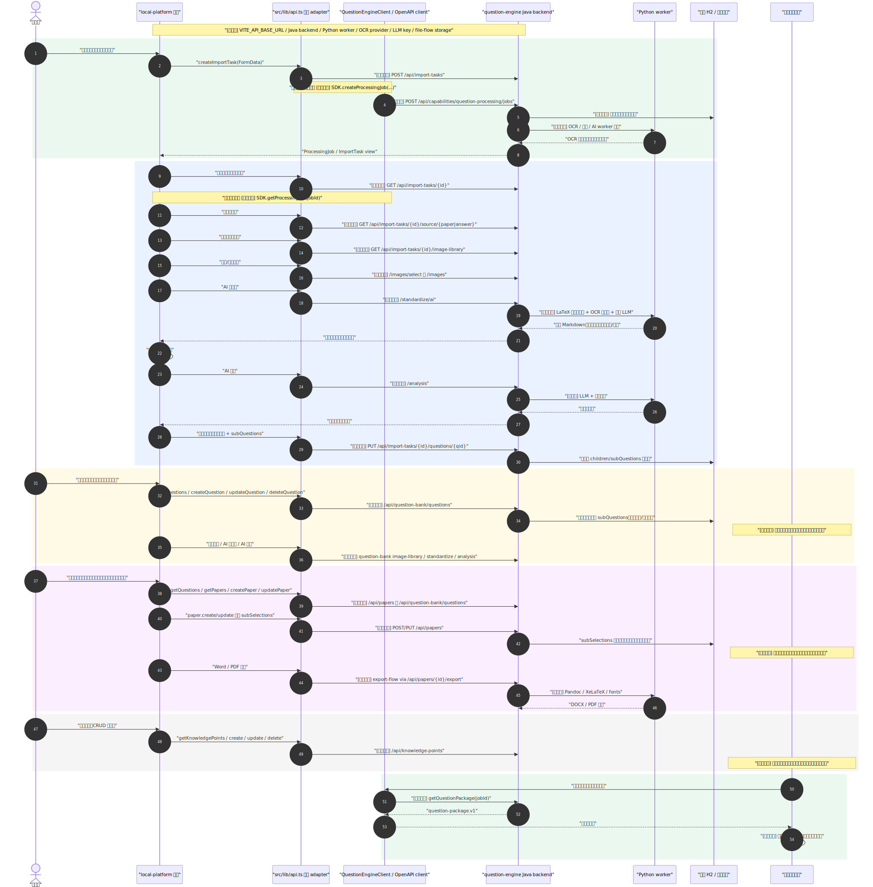

# Example 图示说明

本目录放置 `local-platform` 如何作为 question-engine example 的图示。图示只表达本地 demo、SDK/question-engine 和未来平台职责的关系，不代表公司平台必须复用本地页面代码。

## 文件

- `local-platform-question-engine-sequence.svg`：四个模块调用 SDK/question-engine 的渲染时序图，标记 `[封装能力]`、`[本地演示]`、`[平台自研]` 和 `[需配置]`，并说明 `subQuestions` 与试卷层 `subSelections` 的流转。
- `local-platform-question-engine-sequence.mmd`：时序图 Mermaid 源文件，修改图示时先改这里，再重新渲染 SVG。
- `local-platform-business-flow.svg`：四个模块的渲染业务流程图，标记哪些流程已经封装、哪些需要平台自研、哪些依赖配置，包括按小问组卷。
- `local-platform-business-flow.mmd`：业务流程图 Mermaid 源文件，修改图示时先改这里，再重新渲染 SVG。

## 渲染图

## 标记

| 标记 | 含义 |
| --- | --- |
| `[封装能力]` | question-engine 已通过 OpenAPI/SDK 暴露，平台可直接或生成 client 调用 |
| `[本地演示]` | 当前 local-platform 为了跑通闭环的 demo 逻辑 |
| `[平台自研]` | 公司平台必须自己实现或纳入已有系统 |
| `[需配置]` | 部署和运行前需要配置的基础设施、环境变量或密钥 |

## 阅读顺序

1. 先读 `../product/LOCAL_PLATFORM_AS_EXAMPLE.md`，确认四个模块的代码和能力边界。
2. 再看 `local-platform-business-flow.svg`，理解业务闭环。
3. 最后看 `local-platform-question-engine-sequence.svg`，理解调用时序和 SDK 替换点。
