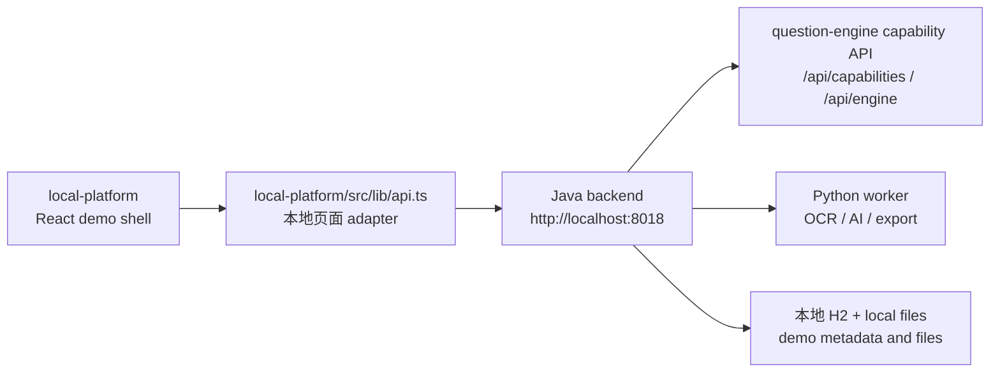
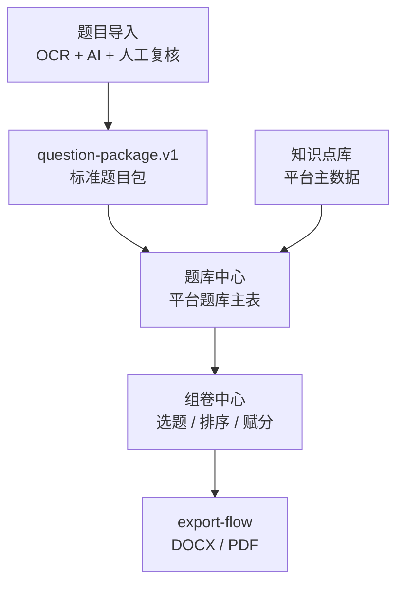
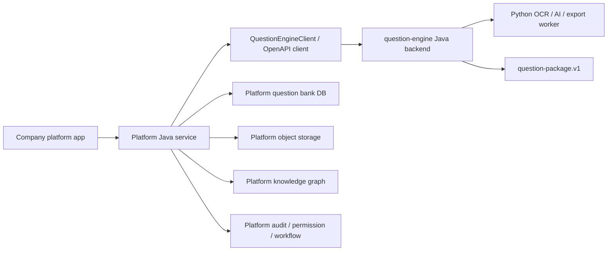

# local-platform 作为 question-engine 使用示例

本文说明 `local-platform` 四个模块如何结合本地代码、SDK 和 question-engine 封装能力运行起来。它的目标不是让公司平台复制本地页面代码，而是让平台开发者看清楚：

- 哪些能力已经被 question-engine 封装，可以通过 OpenAPI/SDK 使用。
- 哪些只是本地演示闭环，未来平台应该自己开发。
- 哪些需要部署、对象存储、AI、OCR、权限、回调等配置支撑。

配套图示放在 `docs/example/`：

- `docs/example/README.md`
- `docs/example/local-platform-question-engine-sequence.svg`（渲染图，源文件为同名 `.mmd`）
- `docs/example/local-platform-business-flow.svg`（渲染图，源文件为同名 `.mmd`）


## 标记约定

| 标记 | 含义 | 典型例子 |
| --- | --- | --- |
| `[封装能力]` | question-engine 已经沉淀为能力边界，平台可以通过 `/api/capabilities`、OpenAPI 或 SDK 调用 | `createProcessingJob`、`getQuestionPackage`、题图库、AI 标准化、AI 解析 |
| `[本地演示]` | 当前 `local-platform` 为了跑通本地闭环保留的页面和兼容 API，不应直接作为公司平台 SDK | `/api/import-tasks` 的本地任务列表、单题入本地题库 |
| `[平台自研]` | 公司教育生态平台应自己负责的业务系统能力 | 用户、租户、权限、审核流、最终题库主表、知识点主数据、组卷业务、下载权限 |
| `[需配置]` | 运行 question-engine 或平台接入前必须配置的环境和基础设施 | `VITE_API_BASE_URL`、Java backend、Python worker、OCR provider、LLM key、MinIO、callback secret |

## 一句话结论

`local-platform` 是 question-engine 的本地工作台 example。它展示四个模块如何串起“题目导入、题库中心、组卷中心、知识点库”的业务闭环，但正式平台接入时应以 `question-engine/openapi/question-engine.v1.yaml`、`question-engine/sdk/USAGE.md` 和 `question-package.v1` 为准。

不要把 `local-platform/src/lib/api.ts` 当成正式 SDK。它是本地页面 adapter，里面同时混有稳定能力接口、过渡兼容接口和本地 demo 业务接口。

## 运行结构



当前本地运行时：

- `[需配置]` `local-platform` 默认请求 `http://localhost:8018`，可通过 `VITE_API_BASE_URL` 或 `VITE_API_BASE` 指向 Java backend。
- `[封装能力]` Java backend 暴露 `/api/capabilities`、`/api/engine`、`question-processing`、`file-flow`、`ai-flow`、`callback-flow` 等能力入口。
- `[封装能力]` Python worker 只作为 OCR、AI、导出渲染 worker，由 Java 编排。
- `[本地演示]` 本地 H2 和本地文件目录只服务演示闭环，不是公司平台最终数据源。
- `[平台自研]` 公司平台未来应把用户、租户、权限、审计、最终题库、知识点主数据、试卷主数据和长期文件归档放在平台自己的服务里。

## 代码入口

| 层级 | 本地代码 | 作用 | 正式平台建议 |
| --- | --- | --- | --- |
| 页面路由 | `local-platform/src/App.tsx` | 路由到四个模块：题库、导入、组卷、知识点 | 平台可参考模块划分，不复用路由实现 |
| API adapter | `local-platform/src/lib/api.ts` | 封装页面 fetch 调用 | 不作为正式 SDK；正式平台使用 OpenAPI/SDK |
| SDK | `question-engine/sdk/generated/typescript`、`question-engine/sdk/generated/java` | 面向平台的能力 client | 作为接入起点 |
| OpenAPI | `question-engine/openapi/question-engine.v1.yaml` | 稳定契约源头 | 平台 SDK 生成和接口评审依据 |
| SDK 使用说明 | `question-engine/sdk/USAGE.md` | 平台如何调用 SDK | 平台开发者优先阅读 |

## 四个模块总览

| 模块 | 本地页面 | 核心功能 | 与 question-engine 的关系 |
| --- | --- | --- | --- |
| 题目导入 | `local-platform/src/pages/QuestionImport.tsx` | OCR 任务创建、原文件预览、复合人工复核、题图、AI 标准化/解析、入库 | 最接近 question-engine 封装能力，是平台接入的主参考 |
| 题库中心 | `local-platform/src/pages/QuestionBankCenter.tsx` | 入库题目列表、筛选、查看、新建、复合编辑、小问答案解析、AI 辅助、题图维护 | 部分复用 AI/file-flow，最终题库 CRUD 属于平台自研 |
| 组卷中心 | `local-platform/src/pages/PaperCenter.tsx` | 从题库选题、按小问选择、编辑试卷头、排序、赋分、预览、发布、导出 | 导出计算能力可沉淀为 export-flow，组卷业务和试卷库属于平台自研 |
| 知识点库 | `local-platform/src/pages/KnowledgePointLibrary.tsx` | 知识点 CRUD、搜索、批量删除，支撑题目筛选和编辑 | 属于平台主数据，应由平台自研和治理 |

## 模块一：题目导入

### 本地代码

| 功能区域 | 本地代码 |
| --- | --- |
| 页面入口 | `local-platform/src/pages/QuestionImport.tsx` |
| 新建 OCR 任务和任务记录 | `local-platform/src/components/question-bank/ImportLanding.tsx` |
| 工作台容器和题目导航 | `local-platform/src/components/question-bank/ImportWorkbench.tsx` |
| 单任务详情、原文件预览、批量入库 | `local-platform/src/components/question-bank/ImportWorkbenchTask.tsx` |
| 单题人工校验卡片 | `local-platform/src/components/question-bank/QuestionCard.tsx` |
| 题图上传/选择 | `local-platform/src/components/question-bank/QuestionImageUploader.tsx` |
| Markdown、选项、题图工具 | `local-platform/src/lib/question.ts` |

### 功能清单

| 功能 | 本地调用 | 分类 | 正式平台建议 |
| --- | --- | --- | --- |
| 填写任务标题、学段、学科、年级、地区、年份 | 页面本地 state | `[平台自研]` | 平台按自己的业务表单和枚举治理 |
| 上传试卷文件、可选答案文件 | `POST /api/import-tasks` | `[本地演示]` + `[封装能力]` | 正式用 `QuestionEngineClient.createProcessingJob(...)` 或 OpenAPI multipart client |
| 查看导入任务列表 | `GET /api/import-tasks` | `[本地演示]` | 平台应有自己的导入任务列表，可映射 `listProcessingJobs` 或平台任务表 |
| 重命名导入任务 | `PUT /api/import-tasks/{id}` | `[本地演示]` | 平台任务标题、状态、操作者由平台自管 |
| 删除/批量删除任务 | `DELETE /api/import-tasks/{id}`、`POST /api/import-tasks/batch-delete` | `[本地演示]` | 平台自管逻辑删除、归档、权限 |
| 打开工作台并轮询任务 | `GET /api/import-tasks/{id}` | `[本地演示]` | 稳定能力可用 `getProcessingJob(jobId)`；工作台 UI 由平台自研 |
| 获取标准题目包 | `GET /api/capabilities/question-processing/jobs/{jobId}/question-package` | `[封装能力]` | SDK: `getQuestionPackage(jobId)`，平台最终入库建议消费它 |
| 查看试卷/答案原文件 | `/api/import-tasks/{id}/source/{paper|answer}` | `[封装能力]` + `[需配置]` | 后续统一纳入平台对象存储、签名 URL、下载权限 |
| 显示 OCR 拆题结果 | 导入任务详情中的 `questions` | `[封装能力]` | 结果也可通过 `getQuestionPackage(jobId)` 形成平台标准入库数据 |
| 编辑题干 Markdown/LaTeX、选项、答案、解析、难度、知识点、小问 `subQuestions` | `PUT /api/import-tasks/{taskId}/questions/{qid}` | `[本地演示]` | 平台可自研复核 UI；稳定输出以 `question-package.v1` 为准 |
| 任务题图库 | `GET /api/import-tasks/{id}/image-library` | `[封装能力]` | SDK: `getImportTaskImageLibrary` |
| 从题图库选择题图 | `POST /api/import-tasks/{id}/questions/{qid}/images/select` | `[封装能力]` | SDK: `selectImportQuestionImages` |
| 上传导入题题图 | `POST /api/import-tasks/{id}/questions/{qid}/images` | `[封装能力]` + `[需配置]` | TS SDK 有 multipart helper；Java client 当前以 JSON API 为主，平台可按 OpenAPI 生成 |
| AI 标准化导入题 | `POST /api/import-tasks/{id}/questions/{qid}/standardize/ai` | `[封装能力]` + `[需配置]` | SDK: `standardizeImportQuestion`，依赖 LLM 配置 |
| AI 解析导入题 | `POST /api/import-tasks/{id}/questions/{qid}/analysis` | `[封装能力]` + `[需配置]` | SDK: `analyzeImportQuestion`，依赖 LLM 和题图读取 |
| 标记已校验 | `PUT /api/import-tasks/{taskId}/questions/{qid}` | `[本地演示]` | 平台审核流、状态机、协作和审计自研 |
| 单题入本地题库 | `POST /api/import-tasks/{id}/questions/{qid}/bank` | `[本地演示]` | 公司平台不要复用；应消费 `question-package.v1` 后写平台题库 |
| 批量入本地题库 | `POST /api/import-tasks/{id}/bank` | `[本地演示]` | 平台自管批量导入、幂等和失败处理 |

### SDK 对应关系

| 页面动作 | 推荐 SDK 方法 |
| --- | --- |
| 检查能力是否可用 | `listCapabilities()`、`getEngineInterfaces()`、`getQuestionProcessingCapability()` |
| 创建题目加工任务 | `createProcessingJob(...)` |
| 查询任务状态 | `getProcessingJob(jobId)` |
| 获取标准题目包 | `getQuestionPackage(jobId)` |
| 获取任务题图库 | `getImportTaskImageLibrary(jobId)` |
| 选择导入题题图 | `selectImportQuestionImages(jobId, questionId, input)` |
| 上传导入题题图 | `uploadImportQuestionImages(jobId, questionId, files)`，TypeScript 已支持 |
| AI 标准化导入题 | `standardizeImportQuestion(jobId, questionId, input)` |
| AI 解析导入题 | `analyzeImportQuestion(jobId, questionId, input)` |

### 平台接入边界

平台只想使用“试卷变标准题目包”时，最小闭环是：

1. `[封装能力]` 调 `createProcessingJob(...)` 上传试卷和答案。
2. `[封装能力]` 调 `getProcessingJob(jobId)` 或接收 callback 获取状态。
3. `[平台自研]` 平台决定是否打开自己的复核页。
4. `[封装能力]` 调题图、AI 标准化、AI 解析接口做局部修正。
5. `[封装能力]` 调 `getQuestionPackage(jobId)` 获取 `question-package.v1`。
6. `[平台自研]` 平台写自己的题库主表、图片表、审核记录、操作日志。

## 模块二：题库中心

### 本地代码

| 功能区域 | 本地代码 |
| --- | --- |
| 页面入口 | `local-platform/src/pages/QuestionBankCenter.tsx` |
| 题目列表、查看、删除、批量删除 | `local-platform/src/components/question-bank/QuestionList.tsx` |
| 题目新建/编辑 | `local-platform/src/components/question-bank/QuestionEditor.tsx` |
| 筛选条件 | `local-platform/src/components/question-bank/QuestionFilters.tsx` |
| 知识点选择 | `local-platform/src/components/question-bank/KnowledgePointSelect.tsx` |
| 题图上传/选择 | `local-platform/src/components/question-bank/QuestionImageUploader.tsx` |

### 功能清单

| 功能 | 本地调用 | 分类 | 正式平台建议 |
| --- | --- | --- | --- |
| 题目列表分页 | `GET /api/question-bank/questions` | `[本地演示]` | 平台题库主表、搜索索引、权限过滤自研 |
| 关键词、题型、难度、知识点等筛选 | `GET /api/question-bank/questions?...` + `GET /api/knowledge-points` | `[平台自研]` | 平台统一题库查询、标签和知识点体系 |
| 查看题目详情 | 页面 dialog 渲染当前题目数据 | `[平台自研]` | 平台按自己的题目详情模型实现 |
| 新建题目 | `POST /api/question-bank/questions` | `[本地演示]` | 平台自管最终题库创建 |
| 编辑题目 | `PUT /api/question-bank/questions/{id}` | `[本地演示]` | 平台自管题目版本、审核、发布 |
| 删除/批量删除题目 | `DELETE /api/question-bank/questions/{id}` | `[平台自研]` | 平台自管回收站、引用检查和权限 |
| 显示/隐藏答案解析 | 前端状态 | `[平台自研]` | 平台 UI 自行决定 |
| Markdown/LaTeX 实时预览 | `MarkdownRenderer` + `local-platform/src/lib/question.ts` | `[本地演示]` | 可参考实现，但不是 question-engine SDK |
| 题库题图片库 | `GET /api/question-bank/questions/{id}/image-library` | `[封装能力]` | SDK: `getBankQuestionImageLibrary` |
| 上传题库题题图 | `POST /api/question-bank/questions/{id}/images` | `[封装能力]` + `[需配置]` | TS SDK 支持 multipart；平台应接入对象存储和权限 |
| 题库题 AI 标准化 | `POST /api/question-bank/questions/{id}/standardize/ai` | `[封装能力]` + `[需配置]` | SDK: `standardizeBankQuestion` |
| 题库题 AI 解析 | `POST /api/question-bank/questions/{id}/analysis` | `[封装能力]` + `[需配置]` | SDK: `analyzeBankQuestion` |
| 知识点选择/快速创建 | `GET /api/knowledge-points`、`POST /api/knowledge-points` | `[平台自研]` | 公司平台应使用统一知识点主数据 |

### SDK 对应关系

题库中心不是完整 question-engine SDK demo。它只有部分能力适合从 question-engine 复用：

| 页面动作 | 推荐 SDK 方法或边界 |
| --- | --- |
| 题库题图库 | `getBankQuestionImageLibrary(questionId)` |
| 题库题 AI 标准化 | `standardizeBankQuestion(questionId, input)` |
| 题库题 AI 解析 | `analyzeBankQuestion(questionId, input)` |
| 题图上传 | TypeScript `uploadBankQuestionImages(questionId, files)` 或平台按 OpenAPI 生成 |
| 含小问题目的复合编辑和 `subQuestions` 持久化 | `[平台自研]`，本地接口用于闭环验证 |
| 题目 CRUD、搜索、版本、审核、发布 | `[平台自研]` |

## 模块三：组卷中心

### 本地代码

| 功能区域 | 本地代码 |
| --- | --- |
| 页面入口、试卷列表、创建入口 | `local-platform/src/pages/PaperCenter.tsx` |
| 试卷编辑、试卷头、题目排序、赋分、预览发布 | `local-platform/src/components/paper/PaperEditor.tsx` |
| 从题库选题/追加题目 | `QuestionFilters` + `api.getQuestions(...)` |

### 功能清单

| 功能 | 本地调用 | 分类 | 正式平台建议 |
| --- | --- | --- | --- |
| 试卷列表分页 | `GET /api/papers` | `[本地演示]` | 平台试卷库、权限、状态、发布流程自研 |
| 按试卷名称、学科、年级搜索 | `GET /api/papers?page=&pageSize=&subject=&grade=&keyword=` | `[平台自研]` | 平台按自己的试卷索引实现 |
| 删除/批量删除试卷 | `DELETE /api/papers/{id}` | `[平台自研]` | 平台要处理引用、权限和回收站 |
| 新建试卷时从题库选题 | `GET /api/question-bank/questions` | `[平台自研]` | 平台题库检索和选题策略自研 |
| 含小问题目按小问选择 | 页面 state + `subSelections` + `POST/PUT /api/papers` | `[平台自研]` | 小问选择只保存在试卷层，不修改题库原题 |
| 编辑试卷头 | 页面 state + `POST/PUT /api/papers` | `[平台自研]` | 平台自管试卷模板、考试信息、元数据 |
| 拖拽排序 | 前端 `Reorder` | `[平台自研]` | 平台 UI 行为自研 |
| 每题赋分 | 页面 state + `scores` | `[平台自研]` | 平台按考试/试卷模型自管 |
| 追加题目 | `GET /api/question-bank/questions` | `[平台自研]` | 平台按题库检索和组卷规则实现 |
| 预览并发布 | `POST /api/papers` 或 `PUT /api/papers/{id}` | `[本地演示]` | 平台发布流、审核、版本和权限自研 |
| Word/PDF 导出 | `GET /api/papers/{paperId}/export?format=docx|pdf&variant=teacher` | `[封装能力]` + `[需配置]` | 可沉淀为 export-flow；导出任务元数据、文件存储、下载权限由平台/Java 编排 |

### 与 question-engine 的关系

组卷中心当前更多是本地平台业务。question-engine 能提供的主要是：

- `[封装能力]` 题目内容来自 `question-package.v1` 或平台题库。
- `[封装能力]` 导出渲染能力可由 export-flow/Python worker 提供。
- `[本地演示]` `subSelections` 验证按小问组卷；正式平台应在自己的试卷模型中保存等价选择关系。
- `[需配置]` Pandoc、XeLaTeX、中文字体、导出文件存储需要配置。

平台必须自研：

- 组卷规则、选题策略、试卷模板。
- 试卷版本、发布、审核、权限。
- 试卷与课程、考试、班级、作业等业务对象的关系。
- 导出文件的长期存储、下载鉴权和审计。

## 模块四：知识点库

### 本地代码

| 功能区域 | 本地代码 |
| --- | --- |
| 页面入口、列表、搜索、弹窗编辑 | `local-platform/src/pages/KnowledgePointLibrary.tsx` |
| 题目筛选中使用知识点 | `local-platform/src/components/question-bank/QuestionFilters.tsx` |
| 题目编辑中选择/创建知识点 | `local-platform/src/components/question-bank/KnowledgePointSelect.tsx` |

### 功能清单

| 功能 | 本地调用 | 分类 | 正式平台建议 |
| --- | --- | --- | --- |
| 知识点列表 | `GET /api/knowledge-points` | `[平台自研]` | 公司平台统一维护知识点主数据 |
| 本地搜索知识点名称、学科、年级、说明 | 前端过滤 | `[平台自研]` | 平台应提供服务端搜索、树结构、版本治理 |
| 新建知识点 | `POST /api/knowledge-points` | `[平台自研]` | 平台应有主数据权限和审批 |
| 编辑知识点 | `PUT /api/knowledge-points/{id}` | `[平台自研]` | 平台应考虑引用影响 |
| 删除/批量删除知识点 | `DELETE /api/knowledge-points/{id}` | `[平台自研]` | 平台应做引用校验和逻辑删除 |
| 题目编辑时选择知识点 | `GET /api/knowledge-points` | `[平台自研]` | 平台用统一知识体系映射到题目 |
| AI 识别候选知识点 | `question-package.v1` 中的候选字段 | `[封装能力]` | 平台可把 AI 候选映射到自己的知识点 ID |

知识点库不是 question-engine 的核心交付物。question-engine 可以输出候选知识点和题目结构，但知识点树、课程标准、版本、别名、映射关系和治理流程必须由公司平台负责。

## 跨模块数据流



本地闭环中，`QuestionCard` 的“入库”会把导入题写到本地题库，组卷中心再从本地题库选题。正式平台不建议复用这个本地入库动作，而应该把 `question-package.v1` 写入平台题库，再由平台自己的题库查询和组卷模块使用。

## 配置清单

| 配置对象 | 当前作用 | 分类 | 平台接入建议 |
| --- | --- | --- | --- |
| `VITE_API_BASE_URL` / `VITE_API_BASE` | local-platform 指向 Java backend | `[需配置]` | 本地调试配置；正式平台按自己的网关和服务发现配置 |
| Java backend `http://localhost:8018` | 本地 API 入口 | `[需配置]` | 正式环境部署为 question-engine 服务或平台内部能力服务 |
| Python worker | OCR、AI、导出 worker | `[需配置]` | 由 Java 编排，不直接暴露给平台应用 |
| OCR provider / MinerU | 试卷识别 | `[需配置]` | 按 `OCR_FLOW_PROVIDER`、MinerU 命令和算力环境配置 |
| LLM provider / API key | AI 标准化、AI 解析 | `[需配置]` | 平台需要治理模型、密钥、限流和成本 |
| Java file-flow 本地文件或 MinIO | 原文件、题图、导出文件 | `[需配置]` | 正式接入建议接平台对象存储、签名 URL、权限 |
| callback secret | HTTP 回调签名 | `[需配置]` | 平台需要签名校验、幂等键、重试和死信 |
| 知识点主数据 | 题目筛选和题目属性 | `[平台自研]` | 平台统一维护，不应由 question-engine 接管 |
| 用户、租户、权限、审计 | 当前本地未完整实现 | `[平台自研]` | 平台必须自研 |

## 正式平台推荐接入方式



推荐职责：

- 平台前端：实现上传入口、复核页、题库页、组卷页、知识点页、权限展示和业务交互。
- 平台 Java 服务：统一调用 SDK，保存平台任务、权限、审计、重试、回调、MQ、最终入库。
- question-engine Java backend：提供能力目录、任务状态、标准题目包、题图、AI、回调和运行时入口。
- Python worker：只做 OCR、AI 标准化、AI 解析、Pandoc/LaTeX 渲染等计算任务。

## 不推荐接入方式

- 不要复制 `local-platform/src/lib/api.ts` 作为正式 SDK。
- 不要让公司平台直接调用 Python worker。
- 不要把本地 H2、本地文件目录或 demo 数据当作平台主数据。
- 不要让 question-engine 接管平台用户、租户、权限、最终题库、知识点主数据和试卷库。
- 不要把 `/api/import-tasks` 的本地兼容语义当作长期平台契约；正式平台应优先使用 `/api/capabilities/question-processing/jobs` 和 SDK。

## 本地验证

本地演示链路仍应保持可运行，因为它是 question-engine 能力的 example 和验收壳。

```bash
./scripts/start_project_with_java_backend.sh
python scripts/smoke_local_platform_business.py
python scripts/check_question_engine_contract.py
```

当新增稳定能力时，应同步更新：

- `question-engine/openapi/question-engine.v1.yaml`
- `question-engine/sdk/generated/`
- `question-engine/sdk/USAGE.md`
- `docs/delivery/QUESTION_ENGINE_INTERFACE_GUIDE.md`
- `docs/product/LOCAL_PLATFORM_AS_EXAMPLE.md`
- `docs/example/` 下的图示
