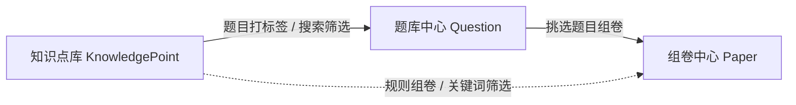

# 题库业务闭环与 question-engine 模块规格

## 文档定位

本文件描述当前本期题库业务闭环和 `question-engine` 四个主模块。文件名保留 `QUESTION_BANK_PHASE_2_SPEC.md` 仅为兼容旧链接，不表示项目仍按阶段拆分。

当前系统同时服务两个目标：

- 本地小平台：提供完整导入、校验、题库维护、知识点维护、组卷和导出闭环。
- 能力发动机：把上述能力封装为可被公司教育生态平台二次集成的 `question-engine`。

平台正式集成时，平台不需要复用本地页面，也不应直接依赖本地演示数据；应优先对接能力 API、OpenAPI/SDK 和 `question-package.v1`。

## 模块总览

`question-engine` 当前包含四个主模块：

- `question-import`：题目导入、OCR-Flow、答案解析匹配、人工校验和入库前状态管理。
- `question-bank`：题库题目的搜索、筛选、查看、编辑、题图管理和 AI 修复。
- `paper-assembly`：选题、组卷、试卷编辑、发布前预览和导出。
- `knowledge-base`：知识点维护和题目/组卷关联。

补充能力：

- `review-workbench`：可嵌入人工校验工作台。
- `ai-flow`：AI 标准化、AI 解析、答案解析匹配。
- `export-flow`：Markdown、DOCX、PDF 导出。
- `file-flow`：原文件、题图、OCR 产物、导出文件存储协议。
- `callback-flow`：任务完成、失败、可重试等事件回调。
- `sdk-openapi`：OpenAPI 和 SDK 交付入口。

## Java 与 Python 分工

Java 主后端负责：

- 业务 API。
- 能力目录和平台契约。
- 导入任务状态机。
- 导入题、题库题、试卷、知识点和文件元数据。
- AI job、导出 job 和 callback event。
- 原文件预览、题图上传、图片库和导出文件存储。
- 与本地小平台和外部平台的接口兼容。

Python worker 负责：

- OCR provider 执行。
- 大模型拆题、AI 标准化和 AI 解析。
- Markdown + LaTeX 公式处理。
- DOCX Pandoc 导出和 PDF XeLaTeX 预览模板渲染。
- 短期兼容 Java bridge 仍需调用的历史接口。

新增业务状态和平台接口应优先放在 Java，不再放入 Python worker。

## 题目导入模块

### 创建任务

创建导入任务时必须填写：

- 学段。
- 学科。
- 年级。
- 地区。
- 年份。
- 标题。

上传文件：

- 试卷文件：必填。
- 答案文件：选填。

Java 接收任务后应：

1. 保存试卷和答案原文件副本。
2. 写入文件元数据。
3. 调用 Python worker 创建试卷 OCR job。
4. 如果存在答案文件，创建答案 OCR job。
5. 同步导入任务元数据。
6. 返回兼容本地工作台的数据结构。

如果 Python worker 调用失败，Java 必须清理本次已保存但未关联成功的文件副本和元数据。

### 任务状态

导入任务状态由 Java 统一派生，前端不应自行组合零散字段：

- `处理中`：试卷或答案 OCR 正在执行。
- `待校验`：OCR 完成并已生成题目，等待人工确认。
- `部分完成`：部分题目已校验或已入库。
- `已完成`：全部题目已入库。
- `可重试`：OCR 失败但仍允许重试。
- `失败`：OCR 失败且不可重试，或任务无法继续自动处理。

状态计算依据：

- `paper_ocr_status`
- `answer_ocr_status`
- `failure_reason`
- `retryable`
- `retryCount/maxRetryCount`
- 导入题状态

### 原文件预览

原文件预览入口保持：

- `/api/import-tasks/{taskId}/source/paper`
- `/api/import-tasks/{taskId}/source/answer`

新任务优先由 Java 从本地文件存储或 MinIO 返回。历史任务没有 Java 文件记录时，可回退 Python worker。

试卷文件额外支持布局解析框预览：

- 任务详情返回只读 `paperLayout`，用于前端在原文件上叠加题目范围框。
- `paperLayout.pages[]` 描述试卷页图，`paperLayout.regions[]` 描述父题级范围，`paperLayout.warnings[]` 描述缺坐标、渲染失败或文件类型不支持等复核提示。
- 试卷页图入口为 `/api/import-tasks/{taskId}/source/paper/pages/{pageIndex}`，多页 PDF 使用从 `0` 开始的 `pageIndex`。
- 题目范围框只保留在父题层，不为小问单独生成范围；同一道父题跨页时可在多个页面各显示一个范围框。
- 框编号使用平台导入顺序编号，坐标固定为原始 OCR bbox，不随人工编辑、保存或题干调整而移动。
- 范围生成由 Python worker `PaperLayoutCapability` 负责，优先使用 MinerU `_middle.json` 的 `pdf_info[].para_blocks`、`discarded_blocks` 和 `page_size`，确保 bbox 坐标与试卷页图同源；缺少 `_middle.json` 时才回退 `content_list`。
- 布局解析框是只读定位能力，不参与题目识别、题图写回或人工编辑稿生成；`OCR_PAPER_LAYOUT_ENABLED=false` 时只关闭范围框，不影响 OCR 题目生成。
- 能力先尝试把 MinerU layout item 回贴到 `sourceEvidence`，并递归提取 middle 嵌套图片路径；`A/B/C/D` 这类短选项标签不能作为可靠 offset 锚点，避免串到下一题公式或正文。
- 当布局匹配只命中小标签、极小框、缺少预期题图或只有图片但缺少题干时，必须降级为几何锚点兜底或 warning，不得高置信显示错误框。
- 能力按页面几何阅读顺序和题号锚点切分父题范围，过滤卷面标题、章节说明和页码；输出的 `regions[]` 绑定平台导入题 `questionId`，锚点不足时给出 warning。
- 用户点击试卷页上的范围框后，右侧人工校验列表滚动到对应父题并短暂高亮。
- 答案文件暂不显示布局解析框；没有可靠 OCR 坐标的题目不显示框，但必须在 warning 中提示。

### 待校验题目

OCR 和拆题完成后，任务生成待校验题目。每道题至少包含：

- 题号。平台展示题号按导入顺序自动生成，不再和 OCR 扫描题号强行对齐，也不因 OCR `q_1..q_n` 重复而去重丢题。
- 题型。
- 题干 Markdown。
- 人工题干 Markdown。
- 题图数组。
- 选项。
- 小问 / 子题，主字段为 `subQuestions`，兼容字段为 `children`。
- 答案。
- 解析。
- 知识点候选。
- 难度。
- 分值。
- 公式校验结果。
- AI 元数据和复核提示。

OCR 来源题号只作为 `sourceQuestionId` 追踪字段。若一份 PDF 同时包含正文题目和答案解析题目，OCR 可能在两个区域重复输出 `q_1..q_n`；导入任务必须保留全部父题，并用平台顺序编号展示为 `1..N`。重复来源 ID 应追加 `__occurrence_2` 等后缀，保证 Java 导入题表不会覆盖同源 ID 的第二次出现。

OCR 拆题必须先抽取结构契约，包括总题数、大题声明和每段题号范围；数字题号先作为候选锚点评分，只有满足段内位置、题号范围、正文区域、题干语义和连续性等条件后才生成题目。卷头说明、答题纸提示、考试时间等区域里的编号不得进入待校验题目。

首次返回给用户前可执行自动标准化：

- `OCR_AUTO_STANDARDIZE_MODE=off|risky|all`，默认 `risky`。
- `risky` 只处理渲染风险、严重 LaTeX、重复 Markdown、图片/选项异常等低置信题。
- 自动标准化不创建 Java AI job；结果写入任务和题目的 `autoStandardize` 元数据。
- 候选必须通过渲染、选项、题图、小问和严重风险硬校验后才允许写回；失败时保留原题。

导入题状态：

- `待校验`
- `已校验`
- `已入库`

Java 必须把导入题和导入题图同步到 `java_import_questions` 和 `java_import_question_images`，并在重试、重拆题或题目列表变化时清理不再存在的数据。

### 重新 OCR 扫描

导入工作台提供“重新 OCR 扫描”入口，用于重新扫描原始试卷/答案文件：

- 接口为 `POST /api/import-tasks/{taskId}/rescan`，由 Java 接管。
- 只重新投递当前任务已有的试卷 OCR job 和可选答案 OCR job。
- 任务或任一 OCR job 正在处理中时必须拒绝重复触发，返回 `409`。
- 重扫启动后任务状态和 OCR 状态显示为 `处理中`，前端自动轮询刷新。
- 当前已提取和已编辑题目不清空、不重建、不覆盖；未来若要把重扫结果重新提题，需要先定义与现有题目的合并规则。

## AI 元数据补全

系统在 OCR 后尝试补全：

- 题型。
- 答案。
- 解析。
- 知识点候选。
- 难度。
- 分值。

AI 上下文包括：

- 题目列表。
- 试卷 OCR 全文。
- 试卷中可能包含的答案解析区域。
- 可选答案文件 OCR 文本。
- 题图和题目结构。
- 小问结构 `subQuestions`，用于把答案、解析、题型、知识点、难度和分值映射到具体小问。

约束：

- 如果 OCR 文本中存在参考答案、答案解析或解答过程，系统应按题号和题干语义匹配到对应题。
- 如果题目包含小问，AI 元数据补全必须按小问 `id`、`label` 或原顺序返回 `subQuestions` 结果；父题 `answer` 和 `analysis` 为空。
- 缺少答案或解析的题保持空值。
- 缺少 OCR 原文证据的答案/解析不得写入。
- 模型不应自行求解并冒充教师原答案。
- 未配置大模型或调用失败时，导入任务仍进入待校验。

## 人工校验模块

人工校验工作台必须支持：

- 试卷/答案原文件预览。
- OCR 状态和失败原因展示。
- 按大题分组展示题目。
- Markdown + LaTeX 题干、答案和解析编辑。
- 含小问题目使用复合编辑器：大题题干/材料编辑区 + 每个小问题干、答案、解析、题型、难度、分值和知识点编辑区。
- 实时渲染预览。
- 预览层必须受控渲染 OCR 输出的 HTML 表格片段，只允许 `table`、`tr`、`td`、`th` 结构进入题目预览，并保留 `rowspan` / `colspan`；不得为了表格预览开启任意 raw HTML。
- 题图查看、上传、从任务题图库导入和移除。
- 题图引用必须使用稳定 `图N` 标签；删除关联图片时，同步清理题干、答案、解析、小问题干和小问答案/解析中的对应引用，且剩余编号不自动重排。
- 选择题选项里的题图必须保留在对应选项中；OCR 原始路径和被换行拆开的图片语法都必须规范为 ``，不得被误追加到题干顶部。
- 知识点选择。
- 难度和分值编辑。
- AI 标准化通过安全闸门后自动应用并保存；只有严重公式风险、渲染校验失败或 `applyBlocked=true` 的候选才展示候选源码和候选预览，等待人工复核。
- AI 标准化不得破坏选择题结构；原 OCR 选项和图片选项优先保留，候选丢失选项时后端应恢复原结构化选项并提示复核。
- AI 解析草稿生成。
- 保存校验结果。
- 单题入库和批量入库。

AI 标准化要求：

- 导入题调用导入题专用接口，题库题调用题库题专用接口。
- Java 创建 AI job、调用 Python worker，并默认将成功返回的 `markdown` 作为候选返回；只有显式请求写回且通过低置信和严重 LaTeX 风险闸门时，才允许写入题目 `manualMarkdown`。
- 如果 OCR 把本题答案、解析、参考答案或解答过程扫进题干，AI 标准化应将其从题干中移除，并返回 `answer`、`analysis`。
- 如果题目已有小问，或候选题干/原始 OCR 显示题目有小问，AI 标准化必须把答案解析归属到 `subQuestions[].answer` / `subQuestions[].analysis`；父题 `answer` / `analysis` 为空。
- Java 只在非小问题目的 `answer` 或 `analysis` 非空时写回父题字段；含小问题目只合并写回 `subQuestions`，前端同步回填对应小问输入框，未返回时保留用户当前内容。
- 复合编辑器必须在每个可编辑小问上保留独立 `AI 标准化` 按钮。小问级标准化只处理当前小问的 `manualMarkdown`；安全候选自动应用并保存到当前小问的题干、答案、解析或选项，阻断候选才展示源码/预览等待人工复核；不得覆盖父题材料、其它小问或题库原题的试卷层小问选择。

AI 解析要求：

- 导入题调用导入题专用接口。
- 题库题调用题库题专用接口。
- 新建题或无来源题 ID 时才使用通用解析接口。
- 带题图题目必须把已保存 `images` 一并送入 AI 解析链路；Java 负责从 `file-flow` 读取题图并转为 worker 内部图片输入，Python worker 负责把图片随 prompt 发给支持多模态的大模型。
- Java 只把可识别为 PNG、JPEG、GIF 或 WebP 的有效题图传给 AI；无效图片应标记跳过原因，不能导致整题解析失败。
- 含小问题目必须把当前 `subQuestions` 传给 AI 解析，模型返回 `subQuestions[].answer` / `subQuestions[].analysis`，前端和 Java 写回时合并到对应小问。
- 复合编辑器必须在每个可编辑小问上保留独立 `AI 解析` 按钮。小问级解析以“大题材料 + 当前小问题干 + 当前小问答案/知识点/题图”为输入，结果只回填当前小问 `answer` / `analysis`；无题目 ID 或未保存草稿使用通用解析入口，但仍要经过 Java 题图 data URL 转换。
- 非小问题目模型返回答案时自动回填答案字段；模型未返回答案时保留当前答案。
- AI 解析结果必须经人工保存后才参与入库。
- 导入工作台提供“AI 解析全部”批量入口：默认只补齐未入库且缺少解析的题目，勾选“覆盖已有解析”后才覆盖未入库题目的已有解析。
- 批量解析普通题按整题生成，复合大题按小问逐个生成；小问提示词必须包含父题材料和当前小问题干，答案使用当前小问答案。
- 批量解析逐题顺序执行并显示 `AI 解析中 n/m`；单题失败不阻断整批，结束后汇总成功/失败数量。
- AI 批量生成的解析不自动改变校验状态，仍需人工保存/确认后才能入库。
- 导入工作台提供“全局标准化”批量入口：确认后逐题标准化当前任务全部题目的题干、答案、解析，以及复合题每个小问的题干、答案、解析。
- 全局标准化由前端编排，不新增后端批量接口；父题题干优先调用导入题上下文标准化接口，答案、解析和小问题干调用通用 Markdown 标准化接口。
- 全局标准化成功项自动保存到导入题草稿，严重 LaTeX 风险、渲染校验失败或 `applyBlocked=true` 的候选不得自动写回；失败项不阻断整批，结束后汇总成功/失败数量。
- 全局标准化不改变题目状态。已入库导入卡片可被标准化，但题库中已入库副本只有在用户再次点击“重新入库”后才会被覆盖。

## 小问与复合题规则

一道大题可以包含多个小问。`Question.subQuestions` 非空时，父题自身的 `answer` 和 `analysis` 应为空，答案、解析、题型、难度、分值和知识点分别落在各个小问上。历史字段 `children` 作为兼容别名保留，创建、更新、导入校验保存和入库时都必须同时返回并持久化等价内容。

OCR-Flow 和 AI-flow 对小问的职责边界：

- OCR-Flow 的大模型拆题负责识别小问边界并产出 `subQuestions`，本地规则只提供候选和兜底。
- AI 元数据补全、AI 标准化和 AI 解析都必须保留小问结构，并把答案解析按小问归属。
- 导入工作台和题库中心改变小问答案解析时，只修改当前题目的 `subQuestions`；组卷中心按小问选择只修改试卷层 `subSelections`，不回写题库原题。

`SubQuestion` 至少包含：

- `id`
- `label`，例如 `(1)`。
- `type`
- `difficulty`
- `score`
- `stem` / `stemMarkdown` / `manualMarkdown`
- `answer`
- `analysis`
- `knowledgePointIds` / `knowledgePoints`
- `images`

人工校验和题库中心共用复合编辑器：上方编辑大题题干/材料，下方逐个编辑小问题干、答案、解析、分值和知识点。列表和查看态必须展示“含 N 小问”标识，并按原顺序渲染每个小问。

复合编辑器支持在可编辑状态下增删小问：

- 普通题也显示“添加小问”入口；添加第一个小问后，题目转为大题带小问，原父题 `answer` / `analysis` 自动迁移到新小问，父题答案解析清空。
- 每个小问提供“删除”操作，必须经确认弹窗后才从当前编辑态移除；删除全部小问后，题目恢复普通题编辑形态，父题答案/解析输入框重新出现。
- 每个小问提供独立 `AI 标准化` 和 `AI 解析` 操作；按钮只在可编辑状态展示，已入库或只读题目不展示。
- 系统自动生成的 `(1)`、`(2)`、`(3)` 标签在增删后保持连续重排；用户手动改过的标签按原值保留。
- 已入库或只读题目不展示添加/删除控件。
- 增删不引入新接口，保存时仍通过 `question.create`、`question.update` 或 `import.update_question` 写入当前 `subQuestions` / `children`。当用户删除全部小问时，保存请求必须携带空数组，以便后端清除旧小问。

## 题图管理

题图是题干的一部分，不是普通附件。

要求：

- 每个导入任务必须形成任务级题图库，来源包括 OCR 题图和该任务中用户上传的题图。
- 人工校验时，用户可以本地上传题图，也可以从当前任务题图库选择题图并关联到当前题目。
- 题目保存和入库时必须同时保留 `images`、`imagePlacements` 和 Markdown 图片引用；`images` 是资产池，placement 决定题干/选项/小问等 owner，Markdown 负责可编辑渲染位置。
- 新上传图片默认 `unassigned`；人工校验可选择题干、A-H 选项、小问、答案、解析、共享材料或装饰图。存在未归属或高置信冲突时不得标记“已校验”。
- 前端不得根据“如图”、图片数等于选项数或数组顺序自动配对 A-D；双栏图片选项由后端 offset/bbox 证据确定。
- 已有图片引用不得重复插入。
- 导入校验、题库列表、题库编辑、组卷选题池和导出都必须渲染题图。
- 导入题题图上传、任务题图库选择、题库题题图上传、图片库和图片访问由 Java `file-flow` 接管。
- 前端渲染 `/api/...` 题图相对地址时必须指向 Java backend。

## 题库中心

题库中心支持：

- 搜索题干、答案、解析和知识点。
- 按题型、难度、知识点、学科、年级、地区和年份筛选。
- 筛选面板保持稳定布局，支持清空筛选。
- 查看题目详情。
- 新建题目。
- 编辑题目。
- 删除题目。
- 批量删除题目。
- AI 标准化。
- AI 解析。
- 题图管理。

编辑题库题时必须复用人工校验能力：

- 题干、答案、解析均支持 Markdown + LaTeX 源码和实时预览。
- 含小问题目必须使用复合编辑器，允许单独维护每个小问的题干、答案、解析、分值和知识点。
- 若题目来自导入任务，AI 标准化应回溯源 OCR 文本辅助修复公式。
- 若题目来自导入任务，题库题编辑时可以查看源任务题图库，并在保存前把选中的题图写入题库题 `images`。
- AI 解析返回答案时自动回填答案草稿。
- 保存前必须由人工确认。

## 知识点库

知识点库支持：

- 新增知识点。
- 编辑知识点。
- 删除知识点。
- 批量删除知识点。
- 维护学科、年级和说明。
- 按名称、学科、年级和说明筛选。
- 弹窗新增和编辑。
- 删除前二次确认。

知识点库是本地题库中心和组卷中心的依赖模块。平台集成时，知识点主数据可以由平台提供，`question-engine` 只返回候选知识点或候选标签。

## 组卷中心

组卷中心包含：

- 试卷列表。
- 新建试卷选题。
- 试卷编辑器。
- 发布前预览。
- Word/PDF 导出。

试卷字段：

- 标题。
- 学科。
- 年级。
- 副标题或考试名称。
- 学校。
- 考试时长。
- 考生须知。
- 答案解析显示策略。
- 题目列表。
- `subSelections`：`Record<questionId, subId[]>`，表示每道含小问题目在本试卷内纳入的小问。
- 每题分值。
- 总分。
- 状态。

选题要求：

- 支持关键词、题型、难度、学科、年级、地区、年份和知识点筛选。
- 勾选状态应跨分页和跨筛选保留。
- 勾选含小问的大题时，默认全选该题所有小问，并展开“选择要纳入试卷的小问”清单。
- 对已经加入试卷的大题，编辑器必须显示“已选 N/M”和“所选小问合计 N 分”；取消勾选时至少保留一个小问。
- 已选数量和清空已选必须可见。
- 未选择题目不得进入试卷编辑器。
- 编辑已有试卷时，追加题目必须复用新建试卷的完整选题交互。
- 已在试卷中的题目必须禁用，避免重复加入。

发布要求：

- 标题必填。
- 题目数量必须大于 0。
- 点击发布前必须先展示试卷预览。
- 用户确认预览后才能保存发布状态。
- 发布前预览只渲染 `subSelections` 选中的小问；没有小问的题目按整题渲染。

小问选择业务规则：

- `paper.create` / `paper.update` 接受可选 `subSelections`，`paper.get` / `paper.list` 原样返回，并始终内嵌完整 `subQuestions`。
- `subSelections[questionId]` 缺失、为空或与当前题目小问无交集时，视为全选，兼容旧试卷。
- 试卷的每题分值仍由 `scores[questionId]` 决定，不随小问选择自动变化；小问 `score` 只用于展示合计提示。
- 修改试卷的小问选择只影响该份试卷，不得修改题库原题。

导出要求：

- DOCX 优先生成 Markdown + LaTeX 中间文件。
- DOCX 优先通过 Pandoc 生成。
- PDF 优先通过 Python worker 的专用 XeLaTeX 预览模板生成，保留数学公式、题型徽标、小问卡片、题图和选项布局。
- 公式应尽量转为 Word 原生公式或由 XeLaTeX 稳定 PDF 渲染；不得把分式、方程组、上下标、角度和科学计数法粗糙降级为普通文本。
- 题图必须按 `imagePlacements` 进入对应题干、选项或小问；未归属图不得静默进入正式导出。
- `tasks` 环境在导出前转为普通 Markdown 列表。
- Pandoc 不可用时 DOCX 使用旧导出 fallback；XeLaTeX 或必要 LaTeX 包不可用时 PDF 使用 ReportLab fallback，并应在运行时状态和日志中暴露降级原因。

## 平台集成输出

平台应优先消费：

- `ProcessingJob`：加工任务视图。
- `question-package.v1`：标准题目包。
- `file-flow` 文件地址或临时访问地址。
- `callback-flow` 任务状态回调。
- OpenAPI/SDK。

平台负责：

- 用户、权限、机构、班级和租户。
- 最终题库表结构。
- 题目版本和审核流。
- 知识点主数据。
- 文件中心长期归档。
- 业务应用入口和页面编排。

## 当前限制

- OpenAPI 静态契约已落在 `question-engine/openapi/question-engine.v1.yaml`，后续需要继续把更多能力细节纳入契约治理。
- TypeScript/Java SDK 已切到 `question-engine/sdk/generated`，后续应替换为 CI 中的标准 OpenAPI generator。
- Python worker 仍保留部分兼容 `/api/*`，后续应继续收敛为内部 worker。
- 真实 MQ、超时扫描、callback 自动重试和死信队列仍需继续企业化。
- 用户认证和权限暂不纳入本期交付。

## 组卷中心与知识点库详细流程

知识点库维护 `KnowledgePoint`，题目通过 `knowledgePointIds` 和 `knowledgePoints` 引用知识点。题库中心沉淀题目后，组卷中心通过题目 ID 组装试卷。

组卷中心用于把题库题目组织成可发布、可导出的试卷。当前前端在左侧导航的“组卷中心”入口内完成试卷列表、新建试卷选题和试卷编辑器三类视图切换。新建试卷流程是先按关键词、题型、难度、知识点、学科、年级、地区、年份筛选题目，勾选题目后生成试卷草稿；如果题目含小问，默认全选该题所有小问，并允许按小问取消或纳入；再填写卷头、考试信息、学校、考试时长、答案解析显示策略和考生须知，最后设置每题赋分、排序并发布。

试卷编辑器必须支持：

- 试卷标题、学科、年级、副标题 / 考试名称、学校、考试时长、答案解析显示策略和考生须知。
- 显示题目数量和满分。
- 每题设置赋分，最小值为 0。
- 含小问题目显示“含 N 小问”“已选 N/M”和所选小问合计分，并把选择结果写入 `subSelections`。
- 拖拽排序、移除题目、追加题目，并按题目 ID 去重。
- 发布时校验标题不能为空、题目数不能为 0。

导出链路区分 DOCX 与 PDF：DOCX 通过 Markdown + LaTeX 中间文件交给 Pandoc 转换，公式由 Pandoc 转为 Word 原生公式；PDF 通过专用 XeLaTeX 试卷模板生成，模板按发布前预览风格渲染卷头、题型徽标、所选小问徽标、小问卡片、题图、选项和解答题作答区。XeLaTeX 不可用时 PDF 回退 ReportLab 旧导出，但复杂公式会降级为文本，应作为环境问题修复。

知识点库用于维护题库搜索、题目打标签和组卷筛选依赖的基础数据。界面需要包含筛选输入框、新建知识点、列表项、编辑和删除操作。删除知识点不会级联修改已经引用它的题目，可能形成悬挂引用，需要人工维护。

关键数据关系：

- `Question.knowledgePointIds`：正式引用知识点 ID。
- `Question.knowledgePoints`：冗余保存知识点名称，便于展示。
- `Paper.subject` / `Paper.grade`：用于试卷列表筛选和展示。
- `Paper.questionIds`：试卷包含的题目及顺序。
- `Paper.scores`：题目 ID 到本卷分值的映射。
- `Paper.subSelections`：题目 ID 到本卷选中小问 ID 列表的映射；缺失、空或失效时等价全选。
- `Paper.header`：副标题、学校、时长、考生须知。

主要接口：

- `GET /api/knowledge-points`
- `POST /api/knowledge-points`
- `PUT /api/knowledge-points/{pointId}`
- `DELETE /api/knowledge-points/{pointId}`
- `GET /api/papers?page=&pageSize=&subject=&grade=`
- `GET /api/papers/{paperId}`
- `POST /api/papers`
- `PUT /api/papers/{paperId}`
- `DELETE /api/papers/{paperId}`
- `GET /api/papers/{paperId}/export?format=docx|pdf&variant=teacher`
- `GET /api/question-bank/questions?...`
